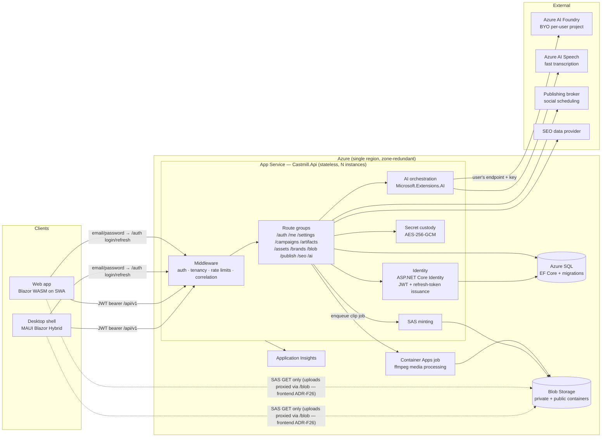

# Castmill Backend — Architecture

> **Doc conventions.** This document follows the Azure Architecture Center reference-architecture format: architecture & dataflow first, then components, decision records, and considerations mapped to the five Well-Architected Framework (WAF) pillars. It is docs-as-code: it lives in the repo, changes ship in the same PR as the code they describe, and decisions are appended as ADRs — never rewritten.
>
> Companion docs: [Frontend-Architecture.md](Frontend-Architecture.md) · [Roadmap-Blazor.md](Roadmap-Blazor.md) · design reference: [Mill Floor handoff](docs/design_handoff_castmill_mill_floor/README.md)

---

## 1. Overview

The Castmill backend is a **single stateless ASP.NET Core (net10.0) Minimal API** service that owns identity enforcement, tenancy, persistence, secret custody, AI orchestration against Azure AI Foundry, and brokered publishing. It is the **only** component that ever holds credentials: storage keys, per-user Foundry keys, and publishing-broker tokens never reach a client.

**Workload shape:** low request volume, high per-request value (AI generation calls costing seconds and cents), strict tenant isolation, bursty media processing. This drives the three core postures: *stateless API + delegated heavy work*, *server-custody of every secret*, and *per-user rate limiting over autoscale complexity*.

## 2. Goals & non-goals

### Goals
| # | Goal | Measure |
|---|---|---|
| G1 | **Tenant isolation is structural, not conventional** | EF global query filters + integration tests proving cross-tenant reads/writes fail |
| G2 | **Zero secrets client-side** | Clients receive only short-lived, single-blob, single-operation SAS URLs and JWTs; audit shows no key material in any response |
| G3 | **Stateless & horizontally scalable** | Any instance can serve any request; no server affinity, no local disk state |
| G4 | **All AI behind one seam** | Every model call goes through `/api/v1/ai/*` via `Microsoft.Extensions.AI` abstractions; a model swap is config, not code |
| G5 | **Provenance is a first-class contract** | Every generation response carries transcript-segment citations; schema-validated before persist |
| G6 | **Deployable from empty subscription in one command** | Bicep + pipeline provisions and deploys end-to-end |
| G7 | **Observable by default** | Correlation ID client→server→dependency in every trace; Server-Timing on hot endpoints |

### Non-goals (v1)
- No external identity provider (Entra, Google, etc.) — identity is **ASP.NET Core Identity with email + password**, wholly owned by the API (ADR-010). No email-based password reset until an email sender exists; password change requires a signed-in session.
- No multi-user sharing, campaign members, or invites — every campaign is owned by the user who created it (ADR-011).
- No streaming token transport (SignalR is a v2 seam, deliberately left open).
- No background job framework (Hangfire/Quartz) — scheduling is delegated to the publishing broker; long media jobs run as Container Apps jobs.
- No multi-region active/active; single region + zone redundancy.
- No app-managed AI billing — Foundry credentials are BYO per user (revisit as ADR when a managed tier is wanted).

## 3. Architecture

### Dataflow (canonical request: "generate campaign")
1. Client holds an app-issued access JWT (from `POST /api/v1/auth/login` with email + password, or a silent `POST /api/v1/auth/refresh`) and calls `POST /api/v1/ai/campaigns` with the campaign brief + transcript reference.
2. Middleware validates the JWT signature against the server-held signing key, resolves `(tenant, user)` (every user owns exactly one tenant, created at registration), stamps the correlation ID, and applies the `ai` rate-limit partition.
3. The AI orchestrator decrypts the caller's Foundry credentials, resolves each generator's model through the alias table, and fans out generation calls; each generator returns typed JSON **with transcript-segment citations**, schema-validated before acceptance.
4. Artifacts persist to Azure SQL as typed JSON content with a `Version` counter; the response carries ETags. Generated images are written to Blob (private), published derivatives (WebP) to the public container.
5. Every dependency call is traced in Application Insights under the request's correlation ID; `Server-Timing` reports the phase breakdown to the client for the Press Run UI.

## 4. Components

| Component | Responsibility | Key constraint |
|---|---|---|
| **Middleware pipeline** | JWT validation (app-issued tokens, server-held signing key), tenant resolution + guard, correlation ID, forwarded headers, HSTS, rate limiting (`ai` 30/min · `writes` 60/min · `searches` 60/min, partitioned by `sub`) | Order is load-bearing; covered by integration tests |
| **Identity** (`Services/Auth`) | ASP.NET Core Identity (email + password): register, login, change-password, lockout, PBKDF2 hashing; issues short-lived (~15 min) access JWTs + rotating refresh tokens; one tenant created per user at registration | No external IdP (ADR-010); Production refuses to start without a JWT signing key; refresh tokens hashed at rest and revocable |
| **Route groups** (Minimal APIs) | One file per group under `Endpoints/`; all require the `TenantAllowed` policy | No controller ceremony; endpoint filters for validation |
| **Persistence** (`Data/`) | EF Core `DbContext`, **real migrations from day one**, global tenant query filters, ETag optimistic concurrency on artifacts, lightweight `Preview` projection (strips heavy content for list views) | `EnsureCreated` is banned; migrations gate deploys |
| **Secret custody** (`Services/Secrets`) | AES-256-GCM encrypted `UserSetting` values; typed accessors per secret kind (Foundry, broker); Production refuses to start without an encryption key | Secrets never appear in logs, responses, or client payloads |
| **SAS service** | Mints single-blob, single-op SAS (10 min default / 1 h cap); public-container write SAS for published WebP with immutable cache headers | Storage account key exists only here |
| **AI orchestration** (`Services/Ai`) | `Microsoft.Extensions.AI` clients (chat, image, transcription), per-user credential resolution, model-alias remap table, fan-out generators, deterministic validators, prompt-transparency ring buffer | One seam (G4); citations required (G5) |
| **Image plan** (`Services/Images`) | Typed `ImageSlot` rows owned by a content artifact (kind, target dimensions, auto/manual prompt, selected reference assets, source segment, state, published URL); up to three brand `product` assets attach automatically; Foundry image edits receive the real reference bytes; slot-accurate resize/crop and server-side headline overlay | Slot state is the single source for every image counter in the UI (ADR-012, ADR-013, ADR-025) |
| **Media** | ≤25 MB path: server-side extract + Foundry transcription. Long media: Azure AI Speech fast transcription. Web clip export **and reference-frame extraction**: Container Apps ffmpeg job reading/writing Blob | API instances never run ffmpeg in-process (ADR-014) |
| **Schedule mirror** | `ScheduleEntry` rows for The Wire (artifact → channel → slot, with queued/sent/error state), reconciled against the broker's queue; the broker remains the scheduler of record | The Wire renders from our data, never blocking on a broker round-trip (ADR-016) |
| **Publishing** | Typed client for the broker (channels, create/cancel scheduled posts); per-channel fan-out with partial-failure reporting | Broker token via secret custody |
| **Infra** (`/infra`) | Bicep: App Service (Linux, zone-redundant plan), Azure SQL, Storage, Container Apps environment, App Insights, SWA | Reprovisionable from scratch (G6) |

### API surface (v1)
`/api/v1` route groups — all `TenantAllowed` except `/health` and `/auth`:
`/auth` (register, login, refresh, logout, change-password) · `/me` (profile, avatar) · `/settings` · `/campaigns` (incl. `/{id}/seo-targets` GET/PUT — ADR-023/026) · `/campaigns/{id}/artifacts` (ETag CRUD) · `/campaigns/{id}/artifacts/{id}/revisions` (list, get, restore — B9) · `/campaigns/{id}/image-slots` (list, create-for-artifact, patch, generate, clear — ADR-025) · `/assets` · `/brands` (incl. `/lookup` draft-from-URL with SSRF guard, brand assets + per-kind templates) · `/blob` (sas, test, list, `assets/{id}/content` upload proxy — frontend ADR-F26) · `/images/composite` (headline overlay — B9) · `/media` (clip-jobs, frames — B9) · `/publish` (channels, posts, test) · `/schedule` (week, create, move, cancel — B9) · `/seo` (analyze, keyword-plan, research, **deep-analysis** — ADR-026, report, share) · `/ai` (status probe, SEO-gated campaign fan-out, per-generator endpoints, render-images, transcription, `runs/latest` — ADR-022/026) · `/health`

## 5. Design decisions (ADR log)

| ADR | Decision | Rationale | Revisit when |
|---|---|---|---|
| ADR-001 | Minimal APIs over MVC controllers | Small surface (~12 groups), endpoint filters cover validation, less ceremony | Surface exceeds ~25 groups or team grows past 3 |
| ADR-002 | Azure SQL + EF Core migrations (no `EnsureCreated`) | Deterministic schema evolution; migrations reviewed in PRs; SQL tooling ecosystem (incl. MSSQL MCP server for agent-assisted inspection) | — |
| ADR-003 | Typed-JSON artifact content column, not normalized tables | Artifact shapes evolve fast per channel; schema validation at the boundary; `Preview` projection solves list-view weight | A reporting workload needs relational queries over content |
| ADR-004 | BYO per-user Foundry credentials | User owns AI spend; no app-level billing/quota liability | Managed tier demanded → new ADR for app-owned Foundry + managed identity |
| ADR-005 | All AI server-side behind `Microsoft.Extensions.AI` | Model portability (Foundry catalog drift), secret custody, single audit point | — |
| ADR-006 | Request/response generation; no streaming in v1 | Fan-out progress (Press Run) needs per-artifact granularity, not per-token; halves transport complexity | Focus-Mode inline rewrite UX wants token streaming → SignalR ADR |
| ADR-007 | Scheduling delegated to publishing broker; no job framework | Broker owns retries/timezones/platform quirks; API stays stateless | Direct platform APIs (v2) force owned scheduling |
| ADR-008 | Heavy media in Container Apps jobs, not App Service | ffmpeg re-encodes starve web workers; jobs scale to zero | — |
| ADR-009 | Per-user fixed-window rate limits over autoscale-first | Cost control on AI endpoints; honest 429s beat surprise bills | — |
| ADR-010 | ASP.NET Core Identity (email + password) with app-issued JWTs; no external identity provider | No Azure app registration is available (rules out Entra/MSA); zero third-party setup or spend; Identity ships hashing/lockout/2FA hooks; the API issues its own JWTs so the bearer middleware and `IAuthTokenProvider` seam are unchanged; an external provider (Google, Entra) can be added later as an additive external login | Multi-team or SSO demand appears, or an email sender is added (enables password reset + external-login linking) |
| ADR-011 | One tenant per user; single-owner campaigns — no members, shares, or invites in v1 | Personal app; tenant-isolation machinery (G1) is retained structurally, so ownership *is* isolation and multi-user later is additive (an `Invitation` table + member rows), not a migration | A second user needs access to a campaign |
| ADR-012 | **Typed image slots**: an `ImageSlot` entity per campaign (kind, target dimensions, prompt, model alias, source segment, state, published URL), reserved when the run starts — not a bag of prompts inside one artifact | The design surfaces image state in three separate places (front-page "slots waiting", campaign-header `n/6` counter, Focus Mode slot list) and places a chosen variant *into* a named slot. A prompt list can't be counted, badged, addressed, or patched; rows can | Slots become user-definable per campaign (then they need a template table) |
| ADR-013 | Thumbnail headline text is **composited server-side** (SkiaSharp) after generation, never prompted into the image | Image models still mangle small text at thumbnail scale; a compositor gives exact safe-area control and lets the headline change without paying for a re-generation | A model renders reliable small text at 1280×720 |
| ADR-014 | Reference-frame extraction runs in the existing Container Apps ffmpeg job, not in-process | Same reason as ADR-008 — ffmpeg re-encodes starve web workers — and the clip job already reads source media from Blob and writes results back | — |
| ADR-015 | `IImageGenerator` is a provider seam; **non-Foundry image providers are admitted** behind a per-user credential slot, feature-flagged off by default | The Image Studio design offers a non-Foundry model (Google "nano banana"). §3.1's Foundry-only rule continues to hold for every *text* generator and for the default image path; admitting one optional image provider is additive, and the alternative is refusing a model the design calls for. Its credential rides the existing AES-256-GCM `UserSetting` custody — no new secret mechanism | A second non-Foundry provider appears (generalize the credential UX), or Foundry ships an equivalent model |
| ADR-016 | Schedule entries are **mirrored** in our database; the publishing broker remains the scheduler of record | The Wire is a persistent workspace surface: it must render on load without a broker round-trip, survive reload, and hold entries the broker hasn't accepted yet. Does not weaken ADR-007 — we never own retries or timezone logic; on reconcile, broker state wins | Direct platform APIs (v2) make us the scheduler of record |
| ADR-017 | Artifact revisions persisted server-side as a bounded ring (last 10), not client-local | Focus Mode's version filmstrip offers compare **and restore**; client-local takes evaporate on reload and never roam between the desktop and web shells. Supersedes the client-local filmstrip note in the frontend dataflow | Diff volume justifies content-addressed dedupe |
| ADR-018 | The whole repo targets the **.NET 10 GA package band** (`10.0.10`, SDK 10.0.302), replacing the rc.1 pins the backend shipped on. `global.json` pins the SDK with `rollForward: latestFeature` so a future major cannot be picked up silently | Forced at the start of frontend F0: every published version of Ignite UI for Blazor floors `Microsoft.AspNetCore.Components.Web` at `>= 10.0.0`, and bUnit 2.x at `>= 10.0.10`, so rc.1 could not restore the client at all. Doing it at F0 was far cheaper than after several client phases had been built on a dead band. Cost was one new GA analyzer (CA1873) and one latent test bug, both fixed; all 80 backend tests pass unchanged on GA | .NET 11 GA, which is a deliberate upgrade with the same re-verification |
| ADR-019 | **Artifacts carry a `Status` column** (Draft/InReview/Queued/Published) changed through a dedicated ETag-guarded `PATCH /artifacts/{id}/status` | The client's review queue, status encoding (frontend ADR-F12) and the Wire queue all read artifact state, and the entity had none — the whole review flow had nothing to read. Status is a distinct intent from a content save, so it is a distinct endpoint with its own guard; the review gate (E6.9) hangs off it. Stored as a string, not an enum, so the set can grow without a migration and the column reads plainly in the database | A fifth state appears, or transitions need role gating |
| ADR-020 | A **second, non-Foundry provider is admitted for text**, scoped to the second-pass **Tech Edit** (`Ai:TextProviders`, alias `chat-tech-edit`, credential `SecretKind.TechEditKey`). Pass 1 and the whole fan-out stay Foundry-only. An optional customer knowledge-base gateway (`KnowledgeBase:*` + `SecretKind.KnowledgeBaseToken`) can brief that pass | §3.1's Foundry-only text rule was written before there was a second pass worth crossing families for; a second opinion from the *same* family is worth much less than one from a different one, and the user's own key means their own billing and quota. ADR-015 named "a second non-Foundry provider appears" as its own revisit trigger — this is it, so the credential UX generalizes rather than being special-cased again. **ADR-005 is not weakened**: the Anthropic SDK's `AsIChatClient` returns a `Microsoft.Extensions.AI.IChatClient`, so no call site learns a second abstraction and an unconfigured provider falls back to Foundry rather than failing. The pass writes **in place behind a revision snapshot** (`reason = "tech-edit"`), and its output is run through the *same* validator pass 1 had to satisfy, so a second pass can never produce an artifact generation would have rejected | A third provider family appears, or Foundry's catalogue makes a direct key unnecessary |
| ADR-021 | **Optional git publishing writes through the Git Data API as one atomic commit**, authenticated by a per-user fine-grained PAT in existing secret custody (`SecretKind.GitHubToken`). Repo profiles are **brand-scoped**; branch names are deterministic (`castmill/{slug}`) and a re-publish updates that branch and reuses its open PR | The Contents API commits once *per file* and is non-atomic: a post is markdown plus several images, so a failure halfway leaves a branch holding the post without its hero image and a green PR the author merges into a broken site. Blobs → tree → commit → ref is one commit and one reviewable diff, and `base_tree` makes create-vs-update transparent, removing the whole stale-blob-sha 409 class. A typed `HttpClient` rather than Octokit because Octokit owns its own `HttpClient` and would sit outside the resilience/telemetry/timeout handling every other outbound call uses, for seven trivially shaped endpoints. A PAT reuses the shipped `BrokerToken` custody with zero new infrastructure, and token acquisition sits behind `IGitHubTokenProvider`-shaped resolution so a GitHub App can replace it without touching the publisher. Deliberately **not** requesting the Workflows permission, and path validation refuses `.github/` and any upward traversal. **Revisit when** an org customer's policy forbids long-lived PATs | A GitHub App becomes necessary, or two-way sync (repo → Castmill) is wanted |
| ADR-022 | **Generation runs are decoupled from their HTTP request**: the fan-out runs on a CTS linked to application shutdown (30-min cap), never to `RequestAborted`; an `InterruptedRunSweeper` hosted service marks runs orphaned by a dead process as `Interrupted` at startup; clients reattach to the live run row via `runs/latest` after a transport fault | A run used to execute inside its request, so a client timeout, closed app or dropped connection cancelled the remaining generators mid-run with the completed items' model spend already paid and nothing reporting the truncation ("said 13 items created, it did not create 13 items"). The one thing that genuinely kills a run — process death — now gets an honest terminal label instead of `Running` forever. Pinned by `RunSurvivalTests` | A queue/worker substrate arrives (then runs become jobs) |
| ADR-023 | **SEO research runs *before* generation** and its result is a campaign-level contract: `/seo/research` (seed keyword → volumes, suggestions, People-Also-Ask with a question-form fallback), the chosen targets persisted via `PUT /campaigns/{id}/seo-targets`, and a `SeoTargetBlock` injected into **every** text generator (primary keyword in title/first heading/first 100 words, secondaries woven, questions answered self-contained, never invent stats). A `{{LINKS}}` placeholder is substituted post-generation from the campaign's context links | Analysing content *after* it is generated means paying twice to fix what a prompt could have gotten right; writing to researched targets makes the first run the correct one. PAA needed live verification: noun-phrase queries rarely carry a PAA box, so the provider falls back to "what is {keyword}" only when the first pass is empty, and questions rank paa > knowledge-base > transcript. Pinned by `SeoTargetTests` (16) and `TargetsStepTests` | The provider adds a batched research endpoint, or targets need per-artifact overrides |
| ADR-024 | **Refresh-token reuse gets a grace window** (`Jwt:RefreshReuseGraceSeconds`, default 60): a replay of a just-consumed token within the window rotates again instead of revoking the family; outside it, reuse detection revokes exactly as before | Strict single-use read three innocent events as theft: the app dying between the exchange and storing its successor, two windows racing one stored token, and a network retry replaying an answered request — each turned into a forced sign-out of a healthy session. Auth0 ships the same mechanism as its "reuse interval". Revoked tokens get **no** grace, and family revocation on out-of-window reuse is unchanged — `RefreshReuseGraceTests` proves the teeth are still in | Refresh volume makes the grace a measurable replay surface |
| ADR-025 | **Every image card is owned by one content artifact**, carries `PromptMode` (`Auto`/`Manual`) and selected brand-asset ids, and is rendered through a reference-aware provider call. The resolver adds up to three brand assets of kind `product` automatically; explicit references and product screenshots are fetched server-side from private Blob and normalized before the Foundry image-edits call | Campaign-wide image controls made it impossible to tell which post an image belonged to and prompt-only “references” could not preserve a person, product or UI. Artifact ownership gives Focus, Image Studio, publishing and insertion one durable scope. Product screenshots are authoritative inputs by default, while manual references remain card-level choices | A provider exposes first-class subject/reference roles or product assets need per-card opt-out |
| ADR-026 | **A persisted deep SEO/AEO report is a hard precondition for even brief generation** (`POST /seo/deep-analysis` → upserted `seo-report`; then campaign targets are approved). Production and AI-brief generation return 409 until both the report and a non-empty approved target set exist. Approval updates the report payload/status as well as the campaign targets. The selected strategy, keyword gaps, existing rankings, answer-engine visibility, authority gap, competitors and report-grounded angles are injected into downstream text prompts. Blog head tags and JSON-LD are stored with the blog artifact, not on the campaign report | A post-hoc keyword report cannot influence titles, angles or copy already paid for. Making analysis a durable stage gives the producer a place to inspect and tune strategy, keeps all channels aligned to one intent, and prevents an alternate API caller from bypassing the wizard. Metadata belongs to the document it publishes with and versions with that document | The product supports non-search campaigns, which would require an explicit waived-analysis state rather than an implicit bypass |
| ADR-027 | **SEO has an explicit expensive report tier with honest partial failure and endpoint provenance.** Keyword research combines DataForSEO Labs Keyword Suggestions (phrase-match long tails), Keyword Ideas (category-adjacent opportunities), and Keyword Overview (exact metrics, difficulty and intent), then records the endpoint paths that completed. The deep report adds advanced organic SERP/PAA/AI Overview, ranked keywords, backlink summaries, domain position footprints, multi-keyword SERP Competitors with topical visibility/ETV, up to five enriched competitor profiles, and four AI-optimization engines. External sections soft-fail into typed `SeoSectionStatus` rows; failed answer engines are excluded from visibility denominators. Content angles are generated from the assembled report and fall back to deterministic keyword-grounded suggestions. Domain citations compare normalized URI hosts, never substrings | An “extreme deep dive” must use the provider dataset suited to each question rather than stretching one SERP into keyword, competitor and authority conclusions. Persisted provenance proves which metered lookups completed; typed availability prevents empty arrays masquerading as measured zeroes; exact host matching prevents `notexample.com` from counting as an `example.com` citation | DataForSEO changes the response contract or report cost/latency requires a queued background job with resumable progress |
| ADR-028 | **Pre-report AI is restricted to research-audience inference; brand voice is authoritative Brand data.** `POST /ai/campaigns/{id}/research-context` reads the transcript and returns only an audience, with no title, angle, keyword or publishable copy, and remains available before the SEO approval gate. Voice is read from the selected Brand's persisted style card; the post-approval brief model no longer infers a speaker voice from the transcript | The report needs a specific audience to shape research, but generating a content brief before research would violate ADR-026. A transcript's speaking style is also not necessarily the organization's approved voice; one persisted Brand must steer every channel consistently | Research audience becomes part of the Brand contract, or campaigns need several audience segments |
| ADR-029 | **Campaign strategy and artifact ownership are durable data.** Campaigns carry Draft/Ready status and a content type; artifacts can name a parent pillar blog; transcript segments retain source labels. Deep reports persist independent input/angle/share staleness, seed a replace-in-place blog placeholder, and post-approval brief generation persists an editable `campaign-summary`. YouTube uses outline → draft → audit and stores scored A/B/C title options plus per-slot revision history. DataForSEO AEO calls resolve each provider's current model from its `/models` catalog and use a 120-second-compatible resilience budget | These concepts drive generation and review after a reload, so transient wizard state or inferred grouping is insufficient. Parent IDs let images, social posts, email, deletion and UI hierarchy agree on ownership; explicit stale layers avoid rerunning paid research when only angles changed; live model discovery prevents provider catalog churn from breaking reports | Supporting artifacts need multiple parents, which would require an edge table rather than one parent column |
| ADR-030 | **Brand asset kind is mutable metadata, and slot composition constraints are server-enforced.** A tenant-scoped Brand endpoint reclassifies an existing asset link without copying Blob data. Both initial image generation and variant steering append the slot's exact pixel dimensions, reduced aspect ratio, central 76% composition zone, no-partial-panel rule and typography guardrails as the final prompt instructions | Asset roles change as kits evolve and should not require destructive unlink/re-upload work. Image providers render to fixed native canvases that are cropped to a slot, so layout safety must be expressed after all brand and steering text on every generation path; a client-only warning cannot protect background jobs or direct API callers | A provider accepts an exact output canvas and layout masks reliably enough to replace prompt-level composition constraints |
| ADR-031 | **The dashboard returns actionable content, not operational artifacts.** Review and aging projections exclude transcripts, image prompts, thumbnail concepts and the persisted deep SEO report; campaign totals remain complete inventory counts. The client independently applies its editable-kind registry as a compatibility guard | The dashboard's Edit action routes to Focus, so returning a report whose canonical editor is the SEO desk turns its structured JSON into a malformed manuscript. Filtering at the projection prevents the bad route, while the client guard protects users during rolling deployment or stale caching | Operational artifacts gain explicit dashboard actions that route to their own dedicated surfaces |
| ADR-032 | **A Brand content template is the authoritative per-kind content brief, including YouTube.** Prompt assembly places it ahead of each generator pass and explicitly gives it precedence over generic writing guidance; the machine-readable JSON shape, transcript grounding, provenance and safety contract remain non-overridable. Templates accept 20,000 characters and persist as `nvarchar(max)` so production strategy prompts are not truncated | Treating a template as a trailing style hint made detailed Brand instructions easy for the model to underweight, and the original 4,000-character boundary rejected the supplied 7,636-character YouTube strategy. Structural contracts must remain stable because validation, rendering and publishing consume typed output | Templates require composable sections or organization-level inheritance rather than one authoritative Brand brief per kind |
| ADR-033 | **Artifact kind roles are a shared Core contract.** `ArtifactKinds.UserContent` names every user-facing text generator; `DistributionContent` narrows that set to finished audience-facing pieces. Brand Template endpoints reject operational generator machinery, and the dashboard's Wire projection admits only distribution content | One artifact table contains publishable copy, strategy documents and pipeline machinery. Treating every generated row alike exposed campaign summaries as creation choices and allowed SEO briefs or clip instructions into scheduling. A small shared role contract keeps API projections and client registries aligned while preserving unknown-artifact compatibility on the Mill Floor | Third-party generators become runtime-configurable, requiring a versioned registry endpoint and persisted role metadata |
| ADR-034 | **SEO research is not a user-generatable artifact role.** Public Mill generation rejects `seo-brief`; deep reports and keyword plans remain SEO-only artifacts. The legacy keyword-plan implementation may use the `seo-brief` schema as an internal structured model pass, but removes that temporary artifact before committing the final plan | Persisting an implementation-stage prompt result promoted it into every generic artifact surface and made it look like publishable copy. The analysis-first architecture needs one authoritative visible research product—the SEO/AEO report—while internal passes remain implementation details | The legacy keyword-plan endpoint is retired in favor of the deep-report pipeline, allowing the internal generator contract to be deleted entirely |
| ADR-035 | **Brand asset reclassification returns the canonical updated asset.** The tenant-scoped kind PATCH validates and persists the role, then returns the complete `BrandAssetResponse`; the client replaces its local row with that response | A `204` forced the client to infer that the selected value became durable. When the card simultaneously moved between grouped lists, transient DOM state could disagree with stored metadata. Returning the authoritative row makes reconciliation deterministic and testable | Brand asset mutations adopt ETags, requiring conditional PATCH and explicit conflict handling |
| ADR-036 | **Image providers are model-capability aware, and a render failure always reaches the producer as a sentence.** One transport for both Foundry paths (REST `images/generations` and `images/edits` through the resilient `foundry-images` client — the typed SDK is no longer used for images); optional request parameters are asked for only where a model supports them (`IImageModelCapabilities`, seeded: `input_fidelity` = gpt-image-1 only); a 400 that names an unsupported parameter is recorded and the request retried once without it; every provider failure becomes an `ImageProviderException` carrying the provider's own `error.message`, and the endpoint reports that message rather than `ex.GetType().Name` | `input_fidelity=high` was sent on EVERY reference-image render. gpt-image-1 accepts it; **gpt-image-2 rejects it with a 400**, so moving the deployment silently broke 100% of renders that attach a brand or product reference while reference-free renders kept working — a deterministic bug wearing the costume of a flaky one. It survived five diagnosis attempts because the studio only ever printed `InvalidOperationException`: the one string that both hid the cause and looked like bad luck. Capability memory (not a hardcoded model list) means the next deployment swap costs one recorded 400 instead of an outage, and surfacing the provider's own sentence makes the next fault self-diagnosing. A provider-side `TaskCanceledException` is now one take's failure, not an unhandled exception that 500s the batch and leaves the run row stuck `Running` | A provider needs per-model parameter *sets* rather than one repair pass, or capability facts need to outlive the process (a persisted table) |
| ADR-039 | **Campaign mutation responses are authoritative reconciliation rows.** Campaign update returns the complete persisted `CampaignResponse`, including canonical name, status, content type and timestamps; clients use that response to reconcile all cached projections before any optional detail refresh | A rename can appear in the campaign-local header while a separately cached workspace list retains the previous name. One authoritative response avoids a redundant list fetch and gives every projection the exact same committed value | Campaign updates adopt ETags, requiring conflict-aware reconciliation rather than unconditional replacement |
| ADR-040 | **Discarded image takes remain part of the recoverable slot inventory.** `GET /image-slots/{slotId}/variants?includeDiscarded=true` is the authoritative all-state projection (`Candidate`, `Kept`, `Discarded`); state PATCH responses return the complete updated row so clients can reconcile card state without a second read. Default exclusion remains available to consumers that only need active work | Discard is explicitly reversible, so a client must be able to distinguish “discarded takes exist but are hidden” from “nothing was ever discarded.” Returning canonical state rows also prevents a successful Keeper action from remaining visually ambiguous until reload | Variant volumes require a paged state-summary envelope with counts independent of the current page |
| ADR-041 | **The workspace image-model default is a non-secret user setting and card overrides are nullable.** `images.default-model` stores only a provider/Foundry alias in `UserSetting`; credentials remain in the encrypted secret store. `ImageSlot.ModelAlias = null` means inherit, while `PATCH` with `UseDefaultModel=true` deliberately clears an override and rejects an ambiguous simultaneous alias. The client resolves the effective alias from the live `/ai/status` catalog and sends it with each render request | A global preference is not credential material and should roam with the signed-in workspace. A nullable override preserves real inheritance: changing Settings affects every card still on default without rewriting campaign rows, while explicit per-image experiments remain durable | Defaults become tenant- or Brand-scoped rather than user/workspace scoped, requiring an explicit precedence chain |
| ADR-037 | **Nano Banana (Gemini) and OpenAI `gpt-image` ship as named, first-class image providers**, each with its own credential slot (`SecretKind.NanoBananaKey`, `SecretKind.OpenAiImageKey`) and its own wire adapter (`Ai:Providers:{name}:Kind` = `gemini` \| `openai`); both are listed in `/ai/status` and the studio's model picker without any config, and the **stored key is the gate** rather than a config flag. A model can also be chosen per batch (`ModelAlias` on generate/steer) without changing the card's saved default | ADR-015 admitted one optional provider behind a config flag and a single shared `ImageProviderKey`. That shape cannot hold two vendors' keys at once, and it made "try this on another model" a config-file edit — unusable as the answer to "the default provider just failed me". Gemini is not an OpenAI-shaped API (contents/parts, `imageConfig.aspectRatio`, inline base64 result), so it needs an adapter, not a config tweak. Keys still ride the existing AES-256-GCM `UserSetting` custody; an *invented* provider still has to opt in with `Enabled=true`, so nothing unknown becomes reachable by default | A fourth provider family appears, or per-tenant (rather than per-user) provider credentials are needed |
| ADR-038 | **A Foundry image deployment's wire dialect is a discovered property, not an assumption, and reference images are normalised before they are sent.** `ImageDialect` (`AzureOpenAI` \| `Mai`) is seeded from the deployment name and self-corrects: a 404 retries once on the other dialect and the winner is remembered. The MAI surface is `{resource}.services.ai.azure.com/mai/v1/images/{generations\|edits}` — derived hostname, **no api-version**, `width`/`height` (≥768 each, ≤1 MP total) instead of `size`, and **exactly one** reference image. References are downscaled to ≤1536 px and sent as JPEG unless they genuinely contain transparency. All image request bodies are buffered so Content-Length is set | `image-alt` (MAI-Image-2.5-Pro) had never once worked: the AzureOpenAI path 404s for it even though the deployment lists as "succeeded", so it looked like a broken deployment rather than a different API family. Three further faults only appeared by driving the real app: references were re-encoded as **PNG q100 at original resolution**, so one phone photo became a **34.9 MB** attachment — over MAI's 20 MB cap outright, and up to eight of those per card meant a multi-hundred-megabyte upload on every gpt-image render too (part of why renders crawled); `JsonContent` streams chunked with no Content-Length, which the MAI gateway rejects outright while Azure OpenAI tolerates it; and `SKBitmap.Decode` **throws** for undecodable bytes rather than returning null, so every `Decode(…) ?? throw` guard in the render path was unreachable. Transparency is now detected by sampling pixels, not by the presence of an alpha channel — PNG screenshots routinely carry a fully-opaque one, and trusting it kept them on the lossless path | Microsoft publishes a stable images route for MAI on the standard deployment path, or a third dialect appears (make the dialect a per-deployment config value rather than a discovered one) |
| ADR-042 | **Source grounding is an immutable `SourceAsset` snapshot plus clone-on-edit `EvidenceBlock` revisions.** A source records its campaign, modality, immutable snapshot hash/identity and current evidence revision. Approval persists the exact tuple `(sourceAssetId, revision, revisionId, approvedEvidenceHash, approvedAt)`; the hash is computed from canonically ordered, included blocks only, and the approved projection filters excluded blocks in SQL. Evidence edits copy the complete current set into a new draft revision, preserving structured locators such as media time ranges. Existing artifact JSON deliberately keeps `citations: string[]`: transcript evidence block IDs are the already-normalized segment IDs (`s01`, `s02`, …), and the citation resolver interprets those strings against an approved source revision without rewriting artifacts or provenance projections | Immutable snapshots prevent a live URL, replaced blob or edited transcript from silently changing the facts behind generated work. Whole-set revisions make an approval marker durable and reproducible while retaining prior text and timing for audit. Reusing segment IDs lets existing campaigns, validators, image source links and provenance threads continue unchanged as new source modalities adopt the generalized evidence contract | Downstream research/artifacts persist the approved tuple and N4 adds dependency staleness; several same-ID sources per campaign require source-qualified citation storage rather than resolver disambiguation |
| ADR-043 | **Research and user-content artifacts retain append-preserving dependency snapshots with normalized approved-evidence edges.** Each observation records every ADR-042 approval field plus the approved report artifact/version, a semantic report-strategy hash and the approved target hash. Report hashes exclude workflow-only status, stale flags and sharing timestamps. Exactly one observation is current per artifact while prior observations remain auditable; generation, regeneration and explicit Keep append a new current observation. Impact compares immutable recorded markers with current approvals and classifies user content as Fresh, EvidenceChanged, StrategyChanged, BothChanged or Unknown. Operational artifacts are excluded. Keep changes only the dependency acknowledgement; viewing never acknowledges. Pre-foundation content without a complete snapshot is Unknown/NeedsTransition rather than Fresh | JSON embedded in each output schema would couple provenance to every content type and make impact queries expensive. Normalized evidence edges preserve the complete approval tuple and remain queryable, while one snapshot row holds the campaign strategy identity shared by every edge. Semantic hashing prevents a public-share timestamp or stale badge from invalidating content. Append-preserving acknowledgement makes the producer's explicit decision auditable without rewriting copy | Runtime-configurable generators need an explicit persisted content-role registry; N5 adds a guided transition for Unknown campaigns; restoring an old content revision may eventually restore its dependency observation as one atomic history action |
| ADR-044 | **Restoring an artifact revision atomically restores its historical dependency observation as a new current snapshot.** Every new `ArtifactRevision` optionally links to the `ContentDependencySnapshot` that was current immediately before the content mutation. Restore writes the prior title/body and clones that linked snapshot plus its normalized evidence edges under reason `restored` in the same EF unit of work; it never makes the historical row current again. A legacy revision without a link receives an intentionally incomplete current snapshot and therefore remains `Unknown/NeedsTransition` | Content and the evidence/strategy identity that produced it are one historical take. Restoring only Markdown while retaining today's dependency observation can label old copy Fresh against facts it never consumed; reactivating the old row would mutate history and make repeated restores ambiguous. A nullable link preserves every existing revision, while clone-on-restore keeps the audit trail append-only and lets impact immediately report how the restored take differs from current approvals | Revision history moves to content-addressed storage or needs a first-class compound “take” entity that owns both content and dependency observations |
| ADR-045 | **Every AI content path consumes one immutable approved-evidence projection and persists citations as canonical source-qualified strings.** The wire/storage form remains `citations: string[]`, encoded as `evidence:{sourceAssetId:N}:{stableBlockId}`. Prompts expose only exact canonical IDs; validators accept a legacy local ID only when it resolves to one approved block, normalize it before persistence, and reject ambiguous same-ID sources. The prompt blocks and dependency markers come from the same captured approval tuples, so an approval advancing during model execution cannot relabel the output. Clip boundary fields remain local media-segment IDs and are scoped to the explicitly selected transcript source. Qualified IDs resolve through the evidence API and collapse to local segment IDs only when they belong to the displayed transcript source. On first generation load, a valid transcript artifact that predates ADR-042 is projected idempotently into one approved transcript `SourceAsset` and evidence revision. Evidence approval conditionally updates only the still-current revision, and a filtered unique index guarantees exactly one current dependency snapshot per artifact | Objects in the artifact citation array would break the computed preview projection and every existing client; unqualified strings cannot identify one block once two sources both contain `S1`. One opaque string preserves the stable artifact schema while making source identity durable and queryable. Loading all approved evidence once per orchestration run gives fan-out, blog, YouTube, title regeneration and Tech Edit the same contract. Captured tuples and database-enforced current-row uniqueness keep long model calls and concurrent acknowledgements auditable. Lazy backfill upgrades only tenant-authorized artifacts that are actually used and avoids a fragile SQL migration that would need to parse arbitrary historical JSON | Artifact content moves to a versioned citation-object schema with a dedicated normalized citation table, allowing the string codec and lazy compatibility path to be retired |
| ADR-046 | **Every non-media source enters through one immutable, origin-qualified snapshot writer, and source parsing is an explicitly bounded security boundary.** Public-page requests validate every redirect and connect only to revalidated public addresses with cookies/proxies disabled. Document adapters accept TXT/Markdown/HTML/PDF/DOCX/PPTX through private Blob reads and cap compressed bytes, archive expansion/ratio/entry count, PDF pages, evidence blocks/text, parser time and process-wide parser concurrency. Existing-artifact adapters snapshot an explicit current version or historical revision. Unique identity hashes source kind + immutable origin + content hash, while `SnapshotHash` remains the content hash. `SourceOriginIdentity` enforces that identity. Proactive and lazy transcript compatibility use the same runtime canonical hasher and ID normalizer. Imported source rows and SEO staleness commit together; generated artifact mutations and dependency observations commit together | Content equality is not provenance equality: two URLs or artifact revisions may contain identical bytes but remain distinct sources. Remote fetch and archive parsing are attacker-controlled resource boundaries, not convenience utilities. Runtime backfill avoids SQL/JSON hashing drift while bounded batches keep startup memory flat. Atomic content/provenance writes prevent publishable copy from escaping without the exact evidence tuple it consumed | Extraction becomes a separate sandboxed worker with content-addressed snapshot storage and asynchronous progress for very large sources |
| ADR-047 | **Campaign intent and output recipe are durable, independently validated run-plan fields.** `Campaign.Intent` stores one canonical intent and `OutputRecipeJson` stores only user-generatable artifact kinds. Create/update responses return both. Omitted fields on an unrelated update preserve their existing values; intent changes stale analysis inputs while recipe-only changes do not. Legacy rows remain nullable, and the corrective migration idempotently repairs databases whose migration history advanced without the two physical columns | Source modality, why the campaign exists, and what to print are different decisions that must survive reload and direct API use. Treating the recipe as transient wizard state made Press Run irreproducible; treating omission as clearing let Rename erase the plan | Recipes need per-item settings, ordering, or quantities rather than a validated kind list |
| ADR-048 | **Webpage metadata and image candidates are revisioned evidence, and every model-facing source projection is explicitly untrusted data.** Static HTML extraction prefers `article`, then `main`, strips chrome/hidden/non-content elements, and emits title, canonical URL, author, publish/update dates, allowlisted JSON-LD facts, eligible image references, headings and readable text as inspectable `EvidenceBlock` rows. JavaScript shells fail with a recovery action rather than running script. Generator and transcript-shaped research prompts place source text behind non-overridable untrusted-data boundaries; page content can be cited but never treated as instructions | A mutable metadata sidecar would drift from the approved snapshot and could not be corrected, excluded, approved or cited. Static parsing keeps SSRF and script execution boundaries intact. Explicit prompt boundaries are required because attacker-controlled page prose reaches research as well as final generation | A sandboxed rendering service is introduced for JavaScript-only sources, or image candidates become downloadable owned assets rather than URL evidence |
| ADR-049 | **Large media uploads are tenant-scoped, API-proxied block sessions that commit into the existing private `Asset` and transcript pipeline.** `MediaUpload` records campaign/asset ownership, contiguous byte progress, deterministic block ids, status, expiry, errors and the completed transcript artifact. Clients send 4 MiB blocks with SHA-256; the API caps total media at 2 GiB, enforces exact order/length/checksum, stages blocks directly to private Blob, commits one manifest and makes retries idempotent. Cancellation deletes staged/committed Blob data; provider failure returns to `Committed` so transcription retries without uploading again. Short media uses the configured Foundry transcription deployment; >25 MiB or explicit long routing uses Azure Speech and persists the same timed transcript/evidence projection | Buffering a media file defeats resume and API request limits; direct browser-to-Blob requires shell-specific CORS and exposes another transport contract. Small API-proxied blocks bound memory, preserve the one authenticated chokepoint and work identically in WASM/MAUI. Reusing `PersistTranscriptAsync` prevents cloud media from becoming a second evidence model | API bandwidth becomes material enough to justify direct block SAS plus provisioned origin-specific storage CORS |
| ADR-050 | **Production Azure Speech authentication is managed identity; Region+Key remains a local-development fallback.** Bicep provisions one `SpeechServices` account, grants the App Service identity `Cognitive Services User`, and supplies only `Ai__Speech__Endpoint`. Fast transcription requests acquire `https://cognitiveservices.azure.com/.default`; no Speech key is stored in App Service settings | Long-media transcription was implemented but the deployment required an out-of-band Speech resource and key, contradicting reproducible infrastructure and secret-minimization rules. Managed identity makes the Bicep deployment immediately usable and removes another rotation surface | Private networking is required, or Speech adopts a job/notification API better suited to multi-hour media |

## 6. Considerations — Well-Architected pillars

- **Security.** ASP.NET Core Identity with PBKDF2 password hashing and lockout on repeated failures; short-lived (~15 min) app-signed access JWTs + rotating refresh tokens (hashed at rest, revocable on logout/password change); tenant guard on every route; AES-256-GCM secret custody with startup guards (no encryption key or JWT signing key → refuse to start; localhost CORS in Production → refuse to start); SAS least-privilege (single blob, single op, minutes-scale expiry); `appsettings.Local.json` excluded from publish; audit events on security-relevant actions (sign-in, password change, publish).
- **Reliability.** Stateless instances behind zone-redundant plan; ETag concurrency prevents lost updates; idempotent PUTs; transient-fault retry policies on SQL/Blob/HTTP via standard resilience handlers; health endpoint wired to platform probes.
- **Performance efficiency.** `Preview` projections keep campaign-open payloads small; `Server-Timing` exposes phase costs; AI fan-out parallelized per campaign; media off the request path (ADR-008).
- **Cost optimization.** BYO AI spend (ADR-004); Container Apps jobs scale to zero; rate limits cap runaway generation; single-region posture until usage justifies more.
- **Operational excellence.** Bicep-first provisioning; migrations as deploy gate; correlation IDs end-to-end; prompt-transparency log for AI support cases; this doc + ADR log maintained in-PR.

## 7. Phased backlog

**Contract for every phase:** ends in a state that is *committed, CI-green, deployed to the dev environment, and demonstrable*. No phase leaves broken scaffolding for the next. Each phase lists its **check-in gate** — the proof required before the phase's PR merges.

**Status legend:** ✅ complete · 🔶 partially complete (remaining work noted) · ⬜ not started. *(Last updated 2026-07-28.)*

### Phase B0 — Repo & walking skeleton *(size S)* — ✅ complete 2026-07-28
- Solution scaffold: `Castmill.Api`, `Castmill.Core`, test projects; editorconfig, analyzers, nullable enabled.
- `/health` endpoint; CI workflow (build + test on PR).
- **Check-in gate:** CI green; `curl /health` returns 200 locally.

### Phase B1 — Infrastructure as code *(size M)* — 🔶 code complete 2026-07-28 *(full Bicep under `/infra` — App Service + managed identity RBAC, Entra-only SQL, Entra-only Storage w/ containers+queue, ACA env + queue-scaled clip job, App Insights, 5xx alert — plus one-command `deploy.sh` that runs under `az login` alone (no app registration). Template compiles; the G6 gate — first live run into an empty resource group — hasn't been executed yet. Current dev runs on the hand-made SQL/storage.)*
- Bicep under `/infra`: App Service plan + app, Azure SQL (serverless tier to start), Storage, App Insights; deploy workflow.
- No external identity setup — auth is self-contained in the API (ADR-010, lands in B2).
- **Check-in gate:** empty subscription → `deploy` pipeline → `/health` live on App Service (G6 proven at skeleton scale).

### Phase B2 — Identity, tenancy & data core *(size L)* — ✅ complete 2026-07-28 *(412-stale-ETag gate closed by B4's artifact tests; the App Insights trace check still lands with B1's Azure resources)*
- ASP.NET Core Identity (email + password): `/auth` group (register, login, refresh, logout, change-password), app-issued access JWT + rotating refresh token, JWT bearer validation, JWT-signing-key startup guard.
- `TenantAllowed` policy; one tenant created per user at registration (permanent binding); `/me`.
- EF Core model (Tenant, User + Identity tables, Campaign, Artifact, Asset, BrandProfile, UserSetting, AuditEvent) + baseline migration; global query filters; ETag concurrency. Campaigns carry `OwnerId` (ADR-011).
- Correlation-ID middleware; rate-limit policies; integration-test harness (Testcontainers SQL).
- **Check-in gate:** integration tests prove register → login → authorized call → refresh → logout-revocation, G1 (cross-tenant access fails), and 412-on-stale-ETag; a trace in App Insights shows client-supplied correlation ID.

### Phase B3 — Secrets & storage *(size M)* — ✅ complete 2026-07-28 *(SAS is user-delegation via Entra RBAC — no storage account key exists anywhere; shared-key connection string supported as fallback; public-container publish path deferred to B7 where it's consumed)*
- AES-256-GCM `UserSetting` store + typed secret accessors; Production startup guards.
- SAS service + `/blob` group (mint, test, list); public-container publish path with immutable cache headers.
- **Check-in gate:** G2 audit — grep + integration tests show no key material in any response; SAS expiry and op-scoping tested.

### Phase B4 — Core resource APIs *(size L)* — ✅ complete 2026-07-28 *(assets are metadata-only until B3 wires blob SAS; settings refuse the reserved `secret.` prefix until B3's encrypted store)*
- `/campaigns`, `/artifacts` (typed-JSON content + `Preview` projection), `/assets`, `/brands`, `/settings`.
- Endpoint-filter validation.
- **Check-in gate:** full CRUD demonstrable via OpenAPI UI against dev; `Preview` payload for a 50-artifact campaign under 100 KB.

### Phase B5 — AI orchestration on Foundry *(size XL — the critical path)* — ✅ complete 2026-07-28 *(M.E.AI client layer + per-user credential resolution + model-alias table, /ai/status probe, transcript ingest w/ segment IDs, blog outline→draft→cross-model-audit, full fan-out ×13 kinds, deterministic validators incl. hard char caps, prompt-transparency ring buffer, and B5.4 image rendering: gpt-image-2/MAI → WebP (SkiaSharp) → public container → blog `` replacement. All proven via fake-model integration tests; the live-model run awaits Ai:Foundry credentials in appsettings.Development.json — verify with `GET /ai/status?probe=true`.)*
- `Microsoft.Extensions.AI` client layer; per-user Foundry credential resolution; model-alias remap table; `/ai/status` deployment probe.
- Timed-transcript ingest (segment IDs); blog generator (outline → draft → cross-model audit) **with citations**; then the fan-out set (social ×6 with per-platform rules and hard char caps, email sequence, newsletter, landing page, show notes, clip suggestions, image prompts).
- Deterministic validators (word bands, char caps, banned phrases) as a review gate; prompt-transparency ring buffer.
- **Check-in gate:** seeded transcript → full campaign fan-out in dev, every artifact schema-valid with ≥1 citation (G4, G5); model swap demonstrated by config change only.
- *Sub-checkpoints (each its own PR):* B5.1 client layer + probe · B5.2 transcript + blog · B5.3 social/email/landing/notes · B5.4 images · B5.5 validators + log.

### Phase B6 — Media pipeline *(size L)* — ✅ complete 2026-07-28 *(≤25 MB Foundry transcription + Azure AI Speech fast-transcription w/ diarization, blob-fed, auto-routed by size; clip export: `/media/clip-jobs` enqueue/status, storage-queue dispatch, hash-stored single-use callback tokens (constant-time compared, burned at terminal status), ffmpeg worker container under `/infra/clipjob` with ACA job + KEDA queue scaler in the Bicep. Lifecycle integration-tested with a captured queue; the live ffmpeg run needs the worker image pushed + infra deployed.)*
- Server transcription: ≤25 MB extract+transcribe path; Azure AI Speech fast-transcription path for long/diarized media.
- Resumable block-blob upload contract for web clients.
- Container Apps ffmpeg job: clip export (stream-copy + re-encode, 9:16 crop, burned captions) Blob-to-Blob; job enqueue/status endpoints.
- **Check-in gate:** browser-only flow ingests a 1 GB video → transcript → exported clip, API instances never exceeding baseline CPU (ADR-008 proven).

### Phase B7 — Publishing & SEO *(size M)* — ✅ complete 2026-07-28 *(typed broker client — token via secret custody — with `/publish` channels/queue/posts/cancel/test and per-channel partial-failure fan-out + publish audit events; SEO provider client with `/seo` analyze (typed report persisted as artifact) / report / share (HTML-encoded public snapshot, `noindex`). SEO provider is **DataForSEO v3** — live-verified 2026-07-28 (real volume/difficulty/CPC through /seo/analyze), plus `/seo/keyword-plan`: internal AI research pass (summary, focus keywords, 3 A/B YouTube titles) → DataForSEO metrics → opportunity-ranked plan artifact. Broker still TBD: fill Publish:BrokerBaseUrl when chosen; client paths may need adjusting to that vendor's shape.)*
- Broker client (channels, schedule, cancel, queue read) with partial-failure fan-out reporting; `/publish` group.
- SEO provider client; `/seo` analyze/report/share (public HTML snapshot, ~90-day SAS).
- **Check-in gate:** post scheduled and cancelled on a sandbox channel from OpenAPI UI; shared report opens unauthenticated.

### Phase B8 — Production hardening *(size M)* — ✅ complete 2026-07-28 *(standard resilience handlers on every outbound HTTP dependency, EF `EnableRetryOnFailure` for Azure SQL, App Insights wiring (activates when the connection string is set), 5xx metric alert in the Bicep, [security review checklist](docs/SECURITY-REVIEW.md) with two live-deploy items open (prod CORS allowlist, alert action group), and [key-rotation runbook](docs/KEY-ROTATION.md). Load pass + game-day drill deferred until a live production deployment exists.)*
- Load pass on hot endpoints; resilience-handler tuning; App Insights dashboards + alerts (5xx rate, AI latency, rate-limit saturation).
- Security review against §6 checklist; key-rotation runbook; penetration checklist (SAS scope, CORS, headers).
- **Check-in gate:** WAF review recorded in this doc; alerts fire in a game-day drill; G7 trace walkthrough documented.

### Phase B9 — Design-driven additions *(size L)* — ✅ complete 2026-07-28 *(all eight stories shipped: `ImageSlot`/`ArtifactRevision`/`ScheduleEntry`/`GenerationRun` entities + `DesignAdditions` migration applied to Azure SQL; `/image-slots` (list·reserve·patch·generate·place·clear), `/images/composite`, `/media/frames`, `/schedule` (list·create·move·cancel·reconcile), `/artifacts/{id}/revisions` (list·get·restore), `/ai/runs/{id}`, `/campaigns/{id}/preview`; `IImageProvider` seam with the Foundry adapter plus a config-gated non-Foundry adapter and per-provider readiness in `/ai/status`. 80 tests green (was 62). **Live-verified 2026-07-28:** reserve 6 slots → gpt-image-2 → cropped to exactly 1280×720 → WebP → headline composited → publicly served (HTTP 200, both base and composited measured at 1280×720), preview counter 1/6. One open item: the overlay uses the platform fallback face — set `Castmill:OverlayFontPath` to a licence-clean condensed face before prod (the API reports `fontFallback: true` until then).)*

Everything here is **additive**: it comes from the [Mill Floor design handoff](docs/design_handoff_castmill_mill_floor/README.md), which surfaces server capabilities B0–B8 don't have. No existing feature is removed or narrowed.

- **B9.1 Image slots** *(size M)* — `ImageSlot` entity + migration; slots reserved by the run: YouTube thumbnail 1280×720, blog header 1600×840, inline ×3 1200×675, social card 1200×1200. `/campaigns/{id}/image-slots` (list · patch prompt/model/aspect · clear), slot counts folded into the campaign `Preview` projection so one call feeds the header counter and the front-page block. Each slot carries the transcript segment that motivated it, so prompts stay provenance-labelled. (ADR-012)
- **B9.2 Slot-accurate output** *(size S)* — models emit only 1536×1024 / 1024×1536 / 1024×1024; add a SkiaSharp resize + aspect-preserving centre-crop pass to the slot's exact dimensions before WebP encode, with the crop rule documented and unit-tested per slot kind.
- **B9.3 Overlay compositor** *(size M)* — `POST /images/composite`: headline ≤32 chars, 8 % dashed-safe-area geometry honoured, condensed face scaled to output height, drop shadow; composites onto the stored WebP without re-generating, and re-composites on headline edit. Font must be a licence-clean embedded face — no system-font assumption on Linux App Service. (ADR-013)
- **B9.4 Reference frames** *(size M)* — `POST /media/frames` extracts a frame at a timestamp through the ACA ffmpeg job, stores it private, returns a short-lived SAS; feeds image-to-image "control with preservation" edits. (ADR-014)
- **B9.5 Second image provider** *(size M)* — `IImageGenerator` seam with the Foundry adapter as default and one non-Foundry adapter behind `Ai:Providers:*`, its key in the encrypted `UserSetting` store; `/ai/status` reports readiness per provider so the client can grey out a model instead of failing a generate. (ADR-015)
- **B9.6 Schedule mirror** *(size M)* — `ScheduleEntry` entity + `/schedule` group (week query · create · move · cancel) with queued/sent/error state; reconcile job pulls broker queue state and lets the broker win. The Wire loads from here. (ADR-016)
- **B9.7 Artifact revisions** *(size M)* — `ArtifactRevision` bounded ring (10) written on every AI regenerate and manual save; `/artifacts/{id}/revisions` list · get · restore, restore being an ordinary ETag-guarded write so concurrency rules don't fork. (ADR-017)
- **B9.8 Press Run granularity** *(size S)* — per-artifact fan-out endpoints already exist; add a run-scoped `runId` + `GET /ai/runs/{runId}` progress projection so the client's card-by-card reveal is driven by real completion events rather than a timer (ADR-006 stands — still no token streaming).
- **Check-in gate:** a run reserves 6 slots → generate into the thumbnail slot → composite a headline → the slot reads DONE with a WebP that is exactly 1280×720; a reference frame extracts from the seeded video; a schedule entry survives an API restart and reconciles against a stubbed broker; a revision restores byte-identical markdown; `/ai/runs/{id}` reports 14 completions in order.

**Dependency order:** B0 → B1 → B2 → B3 → B4 → B5 → {B6, B7 in parallel} → B8 → B9. B9.1/B9.2 unblock the client's Image Studio (F10) and should land first; B9.6 pairs with F8, B9.7 with F5. The frontend consumes each phase as it lands (see [Frontend-Architecture.md](Frontend-Architecture.md) §7 for the interleave).
