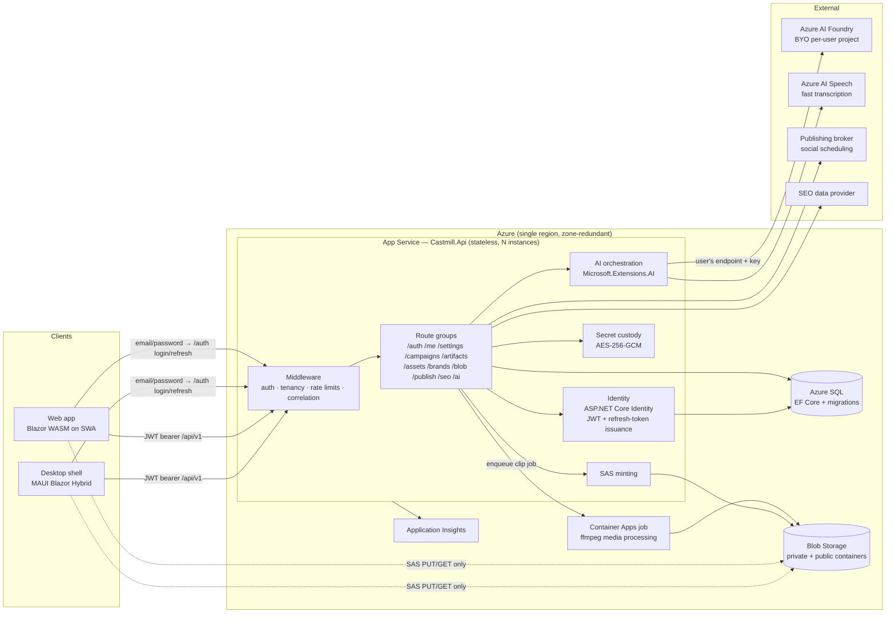

# Castmill Backend — Architecture

> **Doc conventions.** This document follows the Azure Architecture Center reference-architecture format: architecture & dataflow first, then components, decision records, and considerations mapped to the five Well-Architected Framework (WAF) pillars. It is docs-as-code: it lives in the repo, changes ship in the same PR as the code they describe, and decisions are appended as ADRs — never rewritten.
>
> Companion docs: [Frontend-Architecture.md](Frontend-Architecture.md) · [Roadmap-Blazor.md](Roadmap-Blazor.md)

---

## 1. Overview

The Castmill backend is a **single stateless ASP.NET Core (net10.0) Minimal API** service that owns identity enforcement, tenancy, persistence, secret custody, AI orchestration against Azure AI Foundry, and brokered publishing. It is the **only** component that ever holds credentials: storage keys, per-user Foundry keys, and publishing-broker tokens never reach a client.

**Workload shape:** low request volume, high per-request value (AI generation calls costing seconds and cents), strict tenant isolation, bursty media processing. This drives the three core postures: *stateless API + delegated heavy work*, *server-custody of every secret*, and *per-user rate limiting over autoscale complexity*.

## 2. Goals & non-goals

### Goals
| # | Goal | Measure |
|---|---|---|
| G1 | **Tenant isolation is structural, not conventional** | EF global query filters + integration tests proving cross-tenant reads/writes fail |
| G2 | **Zero secrets client-side** | Clients receive only short-lived, single-blob, single-operation SAS URLs and JWTs; audit shows no key material in any response |
| G3 | **Stateless & horizontally scalable** | Any instance can serve any request; no server affinity, no local disk state |
| G4 | **All AI behind one seam** | Every model call goes through `/api/v1/ai/*` via `Microsoft.Extensions.AI` abstractions; a model swap is config, not code |
| G5 | **Provenance is a first-class contract** | Every generation response carries transcript-segment citations; schema-validated before persist |
| G6 | **Deployable from empty subscription in one command** | Bicep + pipeline provisions and deploys end-to-end |
| G7 | **Observable by default** | Correlation ID client→server→dependency in every trace; Server-Timing on hot endpoints |

### Non-goals (v1)
- No external identity provider (Entra, Google, etc.) — identity is **ASP.NET Core Identity with email + password**, wholly owned by the API (ADR-010). No email-based password reset until an email sender exists; password change requires a signed-in session.
- No multi-user sharing, campaign members, or invites — every campaign is owned by the user who created it (ADR-011).
- No streaming token transport (SignalR is a v2 seam, deliberately left open).
- No background job framework (Hangfire/Quartz) — scheduling is delegated to the publishing broker; long media jobs run as Container Apps jobs.
- No multi-region active/active; single region + zone redundancy.
- No app-managed AI billing — Foundry credentials are BYO per user (revisit as ADR when a managed tier is wanted).

## 3. Architecture

### Dataflow (canonical request: "generate campaign")
1. Client holds an app-issued access JWT (from `POST /api/v1/auth/login` with email + password, or a silent `POST /api/v1/auth/refresh`) and calls `POST /api/v1/ai/campaigns` with the campaign brief + transcript reference.
2. Middleware validates the JWT signature against the server-held signing key, resolves `(tenant, user)` (every user owns exactly one tenant, created at registration), stamps the correlation ID, and applies the `ai` rate-limit partition.
3. The AI orchestrator decrypts the caller's Foundry credentials, resolves each generator's model through the alias table, and fans out generation calls; each generator returns typed JSON **with transcript-segment citations**, schema-validated before acceptance.
4. Artifacts persist to Azure SQL as typed JSON content with a `Version` counter; the response carries ETags. Generated images are written to Blob (private), published derivatives (WebP) to the public container.
5. Every dependency call is traced in Application Insights under the request's correlation ID; `Server-Timing` reports the phase breakdown to the client for the Press Run UI.

## 4. Components

| Component | Responsibility | Key constraint |
|---|---|---|
| **Middleware pipeline** | JWT validation (app-issued tokens, server-held signing key), tenant resolution + guard, correlation ID, forwarded headers, HSTS, rate limiting (`ai` 30/min · `writes` 60/min · `searches` 60/min, partitioned by `sub`) | Order is load-bearing; covered by integration tests |
| **Identity** (`Services/Auth`) | ASP.NET Core Identity (email + password): register, login, change-password, lockout, PBKDF2 hashing; issues short-lived (~15 min) access JWTs + rotating refresh tokens; one tenant created per user at registration | No external IdP (ADR-010); Production refuses to start without a JWT signing key; refresh tokens hashed at rest and revocable |
| **Route groups** (Minimal APIs) | One file per group under `Endpoints/`; all require the `TenantAllowed` policy | No controller ceremony; endpoint filters for validation |
| **Persistence** (`Data/`) | EF Core `DbContext`, **real migrations from day one**, global tenant query filters, ETag optimistic concurrency on artifacts, lightweight `Preview` projection (strips heavy content for list views) | `EnsureCreated` is banned; migrations gate deploys |
| **Secret custody** (`Services/Secrets`) | AES-256-GCM encrypted `UserSetting` values; typed accessors per secret kind (Foundry, broker); Production refuses to start without an encryption key | Secrets never appear in logs, responses, or client payloads |
| **SAS service** | Mints single-blob, single-op SAS (10 min default / 1 h cap); public-container write SAS for published WebP with immutable cache headers | Storage account key exists only here |
| **AI orchestration** (`Services/Ai`) | `Microsoft.Extensions.AI` clients (chat, image, transcription), per-user credential resolution, model-alias remap table, fan-out generators, deterministic validators, prompt-transparency ring buffer | One seam (G4); citations required (G5) |
| **Media** | ≤25 MB path: server-side extract + Foundry transcription. Long media: Azure AI Speech fast transcription. Web clip export: Container Apps ffmpeg job reading/writing Blob | API instances never run ffmpeg in-process |
| **Publishing** | Typed client for the broker (channels, create/cancel scheduled posts); per-channel fan-out with partial-failure reporting | Broker token via secret custody |
| **Infra** (`/infra`) | Bicep: App Service (Linux, zone-redundant plan), Azure SQL, Storage, Container Apps environment, App Insights, SWA | Reprovisionable from scratch (G6) |

### API surface (v1)
`/api/v1` route groups — all `TenantAllowed` except `/health` and `/auth`:
`/auth` (register, login, refresh, logout, change-password) · `/me` (profile, avatar) · `/settings` · `/campaigns` · `/campaigns/{id}/artifacts` (ETag CRUD) · `/assets` · `/brands` · `/blob` (sas, test, list) · `/publish` (channels, posts, test) · `/seo` (analyze, report, share) · `/ai` (status probe, campaign fan-out, per-generator endpoints, transcription) · `/health`

## 5. Design decisions (ADR log)

| ADR | Decision | Rationale | Revisit when |
|---|---|---|---|
| ADR-001 | Minimal APIs over MVC controllers | Small surface (~12 groups), endpoint filters cover validation, less ceremony | Surface exceeds ~25 groups or team grows past 3 |
| ADR-002 | Azure SQL + EF Core migrations (no `EnsureCreated`) | Deterministic schema evolution; migrations reviewed in PRs; SQL tooling ecosystem (incl. MSSQL MCP server for agent-assisted inspection) | — |
| ADR-003 | Typed-JSON artifact content column, not normalized tables | Artifact shapes evolve fast per channel; schema validation at the boundary; `Preview` projection solves list-view weight | A reporting workload needs relational queries over content |
| ADR-004 | BYO per-user Foundry credentials | User owns AI spend; no app-level billing/quota liability | Managed tier demanded → new ADR for app-owned Foundry + managed identity |
| ADR-005 | All AI server-side behind `Microsoft.Extensions.AI` | Model portability (Foundry catalog drift), secret custody, single audit point | — |
| ADR-006 | Request/response generation; no streaming in v1 | Fan-out progress (Press Run) needs per-artifact granularity, not per-token; halves transport complexity | Focus-Mode inline rewrite UX wants token streaming → SignalR ADR |
| ADR-007 | Scheduling delegated to publishing broker; no job framework | Broker owns retries/timezones/platform quirks; API stays stateless | Direct platform APIs (v2) force owned scheduling |
| ADR-008 | Heavy media in Container Apps jobs, not App Service | ffmpeg re-encodes starve web workers; jobs scale to zero | — |
| ADR-009 | Per-user fixed-window rate limits over autoscale-first | Cost control on AI endpoints; honest 429s beat surprise bills | — |
| ADR-010 | ASP.NET Core Identity (email + password) with app-issued JWTs; no external identity provider | No Azure app registration is available (rules out Entra/MSA); zero third-party setup or spend; Identity ships hashing/lockout/2FA hooks; the API issues its own JWTs so the bearer middleware and `IAuthTokenProvider` seam are unchanged; an external provider (Google, Entra) can be added later as an additive external login | Multi-team or SSO demand appears, or an email sender is added (enables password reset + external-login linking) |
| ADR-011 | One tenant per user; single-owner campaigns — no members, shares, or invites in v1 | Personal app; tenant-isolation machinery (G1) is retained structurally, so ownership *is* isolation and multi-user later is additive (an `Invitation` table + member rows), not a migration | A second user needs access to a campaign |

## 6. Considerations — Well-Architected pillars

- **Security.** ASP.NET Core Identity with PBKDF2 password hashing and lockout on repeated failures; short-lived (~15 min) app-signed access JWTs + rotating refresh tokens (hashed at rest, revocable on logout/password change); tenant guard on every route; AES-256-GCM secret custody with startup guards (no encryption key or JWT signing key → refuse to start; localhost CORS in Production → refuse to start); SAS least-privilege (single blob, single op, minutes-scale expiry); `appsettings.Local.json` excluded from publish; audit events on security-relevant actions (sign-in, password change, publish).
- **Reliability.** Stateless instances behind zone-redundant plan; ETag concurrency prevents lost updates; idempotent PUTs; transient-fault retry policies on SQL/Blob/HTTP via standard resilience handlers; health endpoint wired to platform probes.
- **Performance efficiency.** `Preview` projections keep campaign-open payloads small; `Server-Timing` exposes phase costs; AI fan-out parallelized per campaign; media off the request path (ADR-008).
- **Cost optimization.** BYO AI spend (ADR-004); Container Apps jobs scale to zero; rate limits cap runaway generation; single-region posture until usage justifies more.
- **Operational excellence.** Bicep-first provisioning; migrations as deploy gate; correlation IDs end-to-end; prompt-transparency log for AI support cases; this doc + ADR log maintained in-PR.

## 7. Phased backlog

**Contract for every phase:** ends in a state that is *committed, CI-green, deployed to the dev environment, and demonstrable*. No phase leaves broken scaffolding for the next. Each phase lists its **check-in gate** — the proof required before the phase's PR merges.

**Status legend:** ✅ complete · 🔶 partially complete (remaining work noted) · ⬜ not started. *(Last updated 2026-07-28.)*

### Phase B0 — Repo & walking skeleton *(size S)* — ✅ complete 2026-07-28
- Solution scaffold: `Castmill.Api`, `Castmill.Core`, test projects; editorconfig, analyzers, nullable enabled.
- `/health` endpoint; CI workflow (build + test on PR).
- **Check-in gate:** CI green; `curl /health` returns 200 locally.

### Phase B1 — Infrastructure as code *(size M)* — 🔶 code complete 2026-07-28 *(full Bicep under `/infra` — App Service + managed identity RBAC, Entra-only SQL, Entra-only Storage w/ containers+queue, ACA env + queue-scaled clip job, App Insights, 5xx alert — plus one-command `deploy.sh` that runs under `az login` alone (no app registration). Template compiles; the G6 gate — first live run into an empty resource group — hasn't been executed yet. Current dev runs on the hand-made SQL/storage.)*
- Bicep under `/infra`: App Service plan + app, Azure SQL (serverless tier to start), Storage, App Insights; deploy workflow.
- No external identity setup — auth is self-contained in the API (ADR-010, lands in B2).
- **Check-in gate:** empty subscription → `deploy` pipeline → `/health` live on App Service (G6 proven at skeleton scale).

### Phase B2 — Identity, tenancy & data core *(size L)* — ✅ complete 2026-07-28 *(412-stale-ETag gate closed by B4's artifact tests; the App Insights trace check still lands with B1's Azure resources)*
- ASP.NET Core Identity (email + password): `/auth` group (register, login, refresh, logout, change-password), app-issued access JWT + rotating refresh token, JWT bearer validation, JWT-signing-key startup guard.
- `TenantAllowed` policy; one tenant created per user at registration (permanent binding); `/me`.
- EF Core model (Tenant, User + Identity tables, Campaign, Artifact, Asset, BrandProfile, UserSetting, AuditEvent) + baseline migration; global query filters; ETag concurrency. Campaigns carry `OwnerId` (ADR-011).
- Correlation-ID middleware; rate-limit policies; integration-test harness (Testcontainers SQL).
- **Check-in gate:** integration tests prove register → login → authorized call → refresh → logout-revocation, G1 (cross-tenant access fails), and 412-on-stale-ETag; a trace in App Insights shows client-supplied correlation ID.

### Phase B3 — Secrets & storage *(size M)* — ✅ complete 2026-07-28 *(SAS is user-delegation via Entra RBAC — no storage account key exists anywhere; shared-key connection string supported as fallback; public-container publish path deferred to B7 where it's consumed)*
- AES-256-GCM `UserSetting` store + typed secret accessors; Production startup guards.
- SAS service + `/blob` group (mint, test, list); public-container publish path with immutable cache headers.
- **Check-in gate:** G2 audit — grep + integration tests show no key material in any response; SAS expiry and op-scoping tested.

### Phase B4 — Core resource APIs *(size L)* — ✅ complete 2026-07-28 *(assets are metadata-only until B3 wires blob SAS; settings refuse the reserved `secret.` prefix until B3's encrypted store)*
- `/campaigns`, `/artifacts` (typed-JSON content + `Preview` projection), `/assets`, `/brands`, `/settings`.
- Endpoint-filter validation.
- **Check-in gate:** full CRUD demonstrable via OpenAPI UI against dev; `Preview` payload for a 50-artifact campaign under 100 KB.

### Phase B5 — AI orchestration on Foundry *(size XL — the critical path)* — ✅ complete 2026-07-28 *(M.E.AI client layer + per-user credential resolution + model-alias table, /ai/status probe, transcript ingest w/ segment IDs, blog outline→draft→cross-model-audit, full fan-out ×13 kinds, deterministic validators incl. hard char caps, prompt-transparency ring buffer, and B5.4 image rendering: gpt-image-2/MAI → WebP (SkiaSharp) → public container → blog `` replacement. All proven via fake-model integration tests; the live-model run awaits Ai:Foundry credentials in appsettings.Development.json — verify with `GET /ai/status?probe=true`.)*
- `Microsoft.Extensions.AI` client layer; per-user Foundry credential resolution; model-alias remap table; `/ai/status` deployment probe.
- Timed-transcript ingest (segment IDs); blog generator (outline → draft → cross-model audit) **with citations**; then the fan-out set (social ×6 with per-platform rules and hard char caps, email sequence, newsletter, landing page, show notes, clip suggestions, image prompts).
- Deterministic validators (word bands, char caps, banned phrases) as a review gate; prompt-transparency ring buffer.
- **Check-in gate:** seeded transcript → full campaign fan-out in dev, every artifact schema-valid with ≥1 citation (G4, G5); model swap demonstrated by config change only.
- *Sub-checkpoints (each its own PR):* B5.1 client layer + probe · B5.2 transcript + blog · B5.3 social/email/landing/notes · B5.4 images · B5.5 validators + log.

### Phase B6 — Media pipeline *(size L)* — ✅ complete 2026-07-28 *(≤25 MB Foundry transcription + Azure AI Speech fast-transcription w/ diarization, blob-fed, auto-routed by size; clip export: `/media/clip-jobs` enqueue/status, storage-queue dispatch, hash-stored single-use callback tokens (constant-time compared, burned at terminal status), ffmpeg worker container under `/infra/clipjob` with ACA job + KEDA queue scaler in the Bicep. Lifecycle integration-tested with a captured queue; the live ffmpeg run needs the worker image pushed + infra deployed.)*
- Server transcription: ≤25 MB extract+transcribe path; Azure AI Speech fast-transcription path for long/diarized media.
- Resumable block-blob upload contract for web clients.
- Container Apps ffmpeg job: clip export (stream-copy + re-encode, 9:16 crop, burned captions) Blob-to-Blob; job enqueue/status endpoints.
- **Check-in gate:** browser-only flow ingests a 1 GB video → transcript → exported clip, API instances never exceeding baseline CPU (ADR-008 proven).

### Phase B7 — Publishing & SEO *(size M)* — ✅ complete 2026-07-28 *(typed broker client — token via secret custody — with `/publish` channels/queue/posts/cancel/test and per-channel partial-failure fan-out + publish audit events; SEO provider client with `/seo` analyze (typed report persisted as artifact) / report / share (HTML-encoded public snapshot, `noindex`). SEO provider is **DataForSEO v3** — live-verified 2026-07-28 (real volume/difficulty/CPC through /seo/analyze), plus `/seo/keyword-plan`: AI seo-brief (summary, focus keywords, 3 A/B YouTube titles) → DataForSEO metrics → opportunity-ranked plan artifact. Broker still TBD: fill Publish:BrokerBaseUrl when chosen; client paths may need adjusting to that vendor's shape.)*
- Broker client (channels, schedule, cancel, queue read) with partial-failure fan-out reporting; `/publish` group.
- SEO provider client; `/seo` analyze/report/share (public HTML snapshot, ~90-day SAS).
- **Check-in gate:** post scheduled and cancelled on a sandbox channel from OpenAPI UI; shared report opens unauthenticated.

### Phase B8 — Production hardening *(size M)* — ✅ complete 2026-07-28 *(standard resilience handlers on every outbound HTTP dependency, EF `EnableRetryOnFailure` for Azure SQL, App Insights wiring (activates when the connection string is set), 5xx metric alert in the Bicep, [security review checklist](docs/SECURITY-REVIEW.md) with two live-deploy items open (prod CORS allowlist, alert action group), and [key-rotation runbook](docs/KEY-ROTATION.md). Load pass + game-day drill deferred until a live production deployment exists.)*
- Load pass on hot endpoints; resilience-handler tuning; App Insights dashboards + alerts (5xx rate, AI latency, rate-limit saturation).
- Security review against §6 checklist; key-rotation runbook; penetration checklist (SAS scope, CORS, headers).
- **Check-in gate:** WAF review recorded in this doc; alerts fire in a game-day drill; G7 trace walkthrough documented.

**Dependency order:** B0 → B1 → B2 → B3 → B4 → B5 → {B6, B7 in parallel} → B8. The frontend consumes each phase as it lands (see [Frontend-Architecture.md](Frontend-Architecture.md) §7 for the interleave).
