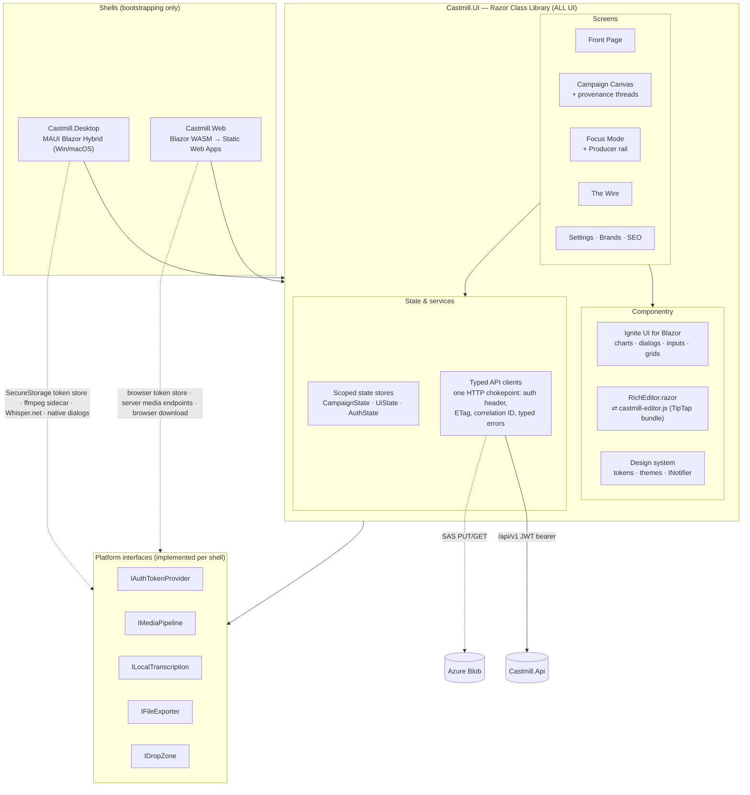

# Castmill Frontend — Architecture

> **Doc conventions.** Same format as the backend doc (Azure Architecture Center reference-architecture structure; decisions as ADRs; considerations mapped to Well-Architected pillars; docs-as-code, updated in the same PR as the change).
>
> Companion docs: [Backend-Architecture.md](Backend-Architecture.md) · [Roadmap-Blazor.md](Roadmap-Blazor.md)

---

## 1. Overview

The Castmill client is **one Blazor codebase shipped through two shells**: a .NET MAUI Blazor Hybrid desktop app (Windows + macOS) and a Blazor WebAssembly web app hosted on Azure Static Web Apps. Every page, component, style, and service lives in a shared Razor Class Library (`Castmill.UI`); the shells contain only bootstrapping and platform-service implementations behind a small set of interfaces.

Component strategy: **Ignite UI for Blazor** for structured surfaces (charts, grids, dialogs, tabs, inputs, toasts, trees); **custom Razor + CSS** for the differentiated "Mill" UX (Front Page, Campaign Canvas, Focus Mode, The Wire); and exactly **one JS-interop component that matters** — the markdown editor.

## 2. Goals & non-goals

### Goals
| # | Goal | Measure |
|---|---|---|
| G1 | **One UI codebase, two shells** | Zero `.razor` files outside `Castmill.UI`; enforced by CI check |
| G2 | **The editor contract is markdown-only** | Markdown string in → markdown string out; no HTML or editor-JSON ever persisted; CI-gated round-trip suite |
| G3 | **Desktop-only features degrade gracefully on web** | Feature flags per capability; web never renders a dead control |
| G4 | **The Mill UX performs** | Canvas: 60 fps pan/zoom with 100 cards on WASM; Front Page < 1 s on seeded data |
| G5 | **Keyboard-first** | Entire review flow operable via ⌘K + keyboard; visible focus states everywhere |
| G6 | **Both themes are first-class** | Every token defined for light + dark (warm charcoal); WCAG AA text contrast in both |
| G7 | **JS is quarantined** | JS interop limited to: editor bundle, clipboard, file download, localStorage — each behind a .NET interface |

### Non-goals (v1)
- No real-time co-editing or presence.
- No offline-first sync (desktop caches nothing beyond per-device UI state).
- No URL deep-link contract beyond campaign/artifact routes (share links are a v2 concern).
- No mobile shells.

## 3. Architecture

### Dataflow (canonical interaction: review a generated blog)
1. Front Page's "Ready for review" lists artifacts from the campaign `Preview` projection (small payload, G4).
2. Selecting the card opens Focus Mode; the full artifact loads with its ETag; the markdown string is handed to `RichEditor.razor` → `castmill-editor.js` renders it.
3. Edits stay in the editor; on blur, `getMarkdown()` returns the string and the store issues a conditional `PUT` (`If-Match: <etag>`); a 412 surfaces a friendly conflict prompt.
4. Steering from the Producer rail calls the AI endpoint; the returned markdown **fully replaces** editor content (no streaming, per backend ADR-006); the version filmstrip records the prior take locally.
5. Provenance: citation segment IDs on the artifact resolve against the campaign's timed transcript; hover renders the thread/underlines from data already in the store — no extra round-trips.

## 4. Components

| Component | Responsibility | Key constraint |
|---|---|---|
| **Shells** | DI registration of platform services, per-shell token storage (`SecureStorage` / browser storage), window/host chrome | No UI; CI enforces G1 |
| **Design system** (`UI/Design`) | Token sheet as CSS custom properties (paper/ink/ember/brass/sage/panel/rule), light + warm-charcoal dark, Ignite UI theme mapping, type scale (serif display / humanist sans / mono counters), motion spec (200 ms ease-out), `INotifier`, confirm service, empty states | Components consume tokens only — no literal colors in feature CSS |
| **State stores** | Scoped (per-circuit/per-app) plain C# classes with change events; `CampaignState` (campaign + artifacts + transcript), `UiState` (per-device, persisted to localStorage via interop), `AuthState` | No global static state; stores are the only writers |
| **Typed API clients** | One `DelegatingHandler` chokepoint: bearer token via `IAuthTokenProvider`, correlation ID, ETag capture, typed error envelope (`ApiError`, `UnauthorizedError`, `ConflictError`) | UI never touches `HttpClient` directly |
| **RichEditor** | `RichEditor.razor` + esbuild-bundled `castmill-editor.js` (TipTap core, markdown bridge with lettered-list tokenizer disabled, slash menu, bubble menu); blur-commit; outline rail as Blazor sibling fed by heading events | Markdown-only contract (G2); bundle < 250 KB gzip; no framework runtime in the bundle |
| **Campaign Canvas** | Virtualized swimlane storyboard, CSS-transform pan/zoom (no re-layout), glow-ring status, provenance thread overlay (SVG), Press Run print-in animation | G4 budget; respects `prefers-reduced-motion` |
| **The Wire** | Week × channel grid, drag-to-schedule (pointer events, not HTML5 DnD — must work in WebView2/WKWebView), platform preview with char meters | Meters computed from shared `Castmill.Core` limits table |
| **Platform services** | See interface table in [Roadmap-Blazor.md](Roadmap-Blazor.md) §2.2 | Web implementations must exist for every interface, even if the implementation is "feature-flagged off" (G3) |
| **editor-interop** (npm project) | esbuild → single static asset in the RCL; vitest round-trip suite | The only npm surface in the product; versions pinned |

## 5. Design decisions (ADR log)

| ADR | Decision | Rationale | Revisit when |
|---|---|---|---|
| ADR-F01 | All UI in one RCL; shells are bootstrap-only | Two shells that can't drift; one test surface | A shell needs genuinely different UX (mobile) |
| ADR-F02 | Ignite UI for structured surfaces, custom Razor for the Mill UX | Component library where it accelerates; no fighting it where the UX is the product | — |
| ADR-F03 | Markdown-only editor contract via one TipTap interop bundle | Ignite UI has no RTE; markdown keeps every export/persist path trivial and the editor swappable | A .NET-native editor reaches feature parity |
| ADR-F04 | Plain C# state stores over a state-management library | Blazor DI + change events cover the need; fewer concepts | Cross-store orchestration gets tangled |
| ADR-F05 | Pointer-event drag-drop, not HTML5 DnD | HTML5 DnD is unreliable across WebView2/WKWebView/browsers; pointer events are one code path | — |
| ADR-F06 | Per-device UI state in localStorage; everything else server-persisted | Pane/zoom prefs are ergonomics; settings must roam | — |
| ADR-F07 | Blazor Router with campaign/artifact routes from day one | Web deep links cheap now, expensive later; desktop ignores the URL bar | — |
| ADR-F08 | WASM ships with AOT + trimming; measure before adding more | G4 on the canvas; AOT first, exotic optimizations only on evidence | — |

## 6. Considerations — Well-Architected pillars (client lens)

- **Security.** Email/password sign-in against `/api/v1/auth` (ADR-010 in the backend doc); access JWT held in memory by the chokepoint handler; rotating refresh token in OS-protected `SecureStorage` on desktop and browser storage on web; passwords never persisted client-side; no secrets in client config; CSP on SWA (no `unsafe-*` beyond wasm-eval); external links open via `IExternalLinkOpener` only; pasted/AI content rendered through the sanitizing Markdig path.
- **Reliability.** Typed error envelope with actionable messages; 412 conflict UX (reload/merge prompt); blur-commit means at most one keystroke-burst of unsaved work; web upload resumable.
- **Performance efficiency.** Preview projections for lists; canvas virtualization + transform-only pan/zoom; lazy-load heavy views (charts, editor bundle); AOT (ADR-F08); target budgets in G4 measured in CI Playwright runs.
- **Cost optimization.** SWA free/standard tier; no client-side AI spend; image previews served as cached WebP from the public container.
- **Operational excellence.** Correlation ID from the chokepoint into every API call; client telemetry (page timing, API timing) to App Insights; living style-guide route; this doc + ADRs updated in-PR.

## 7. Phased backlog

**Contract for every phase:** committed, CI-green, and *demonstrable in both shells* (or explicitly flagged desktop-/web-only per G3). Frontend phases interleave with backend phases (noted as `needs B*` from [Backend-Architecture.md](Backend-Architecture.md) §7).

### Phase F0 — Shells & walking skeleton *(size S · needs B0)*
- `Castmill.UI` RCL + both shells render one shared page with one Ignite UI component; editor-interop npm project scaffolded with esbuild emitting to RCL wwwroot.
- CI: build both shells, run bUnit + vitest placeholders; the G1 "no UI outside the RCL" check.
- **Check-in gate:** same page pixel-identical in MAUI and WASM; CI enforces G1.

### Phase F1 — Design system *(size M · parallel with B1–B2)*
- Token sheet (light + warm-charcoal dark) as CSS custom properties; theme switch; Ignite UI theme mapping; type scale + motion spec; paper-grain treatment.
- `INotifier` toasts, confirm dialogs, empty states; living style-guide route (dev-only).
- **Check-in gate:** style guide reviewed; AA contrast verified in both themes (G6); Igb components visually indistinguishable from custom chrome.

### Phase F2 — Auth & app skeleton *(size M · needs B2)*
- Sign-in / register / change-password screens (email + password against `/api/v1/auth`) in the RCL; `IAuthTokenProvider` per shell — access JWT in memory, rotating refresh token in `SecureStorage` (desktop) / browser storage (web), silent refresh on 401, cold-start silent restore; sign-out revokes the refresh token; `/me` display.
- HTTP chokepoint handler (bearer, correlation ID, ETag, typed errors); router with campaign/artifact routes (ADR-F07); app chrome (top bar, omnibox placeholder, avatar).
- **Check-in gate:** sign in on both shells against dev API; a forced 401 and 412 each render their designed UX.

### Phase F3 — Campaign shell & data views *(size L · needs B4)*
- State stores + typed clients for campaigns/artifacts/assets/brands/settings; Front Page v1 (review list, aging drafts) on `Preview` data; campaign create/settings dialogs; asset library grid with SAS-image rendering.
- **Check-in gate:** create campaign → see it on the Front Page → open it, on both shells; Front Page < 1 s on the 50-artifact seed (G4 part 1).

### Phase F4 — Editor *(size M · parallel with B5)*
- `castmill-editor.js` bundle (TipTap core, markdown bridge with lettered-list tokenizer disabled, slash menu, bubble menu) + `RichEditor.razor` blur-commit + outline rail; image/YouTube insert dialogs; Markdig preview surfaces with sanitizer.
- **vitest round-trip suite as a CI gate** (FAQ prose, numbered steps, tasks, images — byte-stable double round-trip).
- **Check-in gate:** G2 proven by the suite; editor identical in both shells; bundle < 250 KB gzip.

### Phase F5 — The Mill core: Canvas + Focus *(size XL · needs B5)*
- Campaign Canvas: virtualized swimlanes, transform pan/zoom, glow rings, card previews.
- Provenance threads: citation → hover trace → side-by-side quoted transcript.
- Focus Mode: filmstrip collapse, manuscript layout, Producer rail (steer, regenerate, two-pass step narration, version filmstrip).
- Press Run: per-artifact print-in driven by fan-out responses; narrated log line; no spinners.
- **Check-in gate:** 60 fps pan/zoom at 100 cards on WASM in the CI Playwright perf run (G4 part 2); full generate → trace → edit → save loop demonstrable.
- *Sub-checkpoints:* F5.1 canvas render/virtualization · F5.2 provenance · F5.3 Focus + Producer · F5.4 Press Run.

### Phase F6 — ⌘K & keyboard flow *(size M)*
- Omnibox: navigation, actions (start run, schedule, regenerate), transcript search; global shortcut map; focus-visible audit.
- **Check-in gate:** scripted keyboard-only review flow passes in Playwright (G5).

### Phase F7 — Media UX *(size L · needs B6)*
- Ingest: drop/upload (pointer + `IDropZone`), paste transcript, URL fetch; resumable web upload UI; desktop local-transcription flow with model download manager; clip review + export (desktop local; web via job status polling).
- Feature-flag surface for desktop-only capabilities with designed web fallbacks (G3).
- **Check-in gate:** web-only user completes ingest→transcribe→clip; desktop user completes it offline (local whisper) — both demonstrable.

### Phase F8 — The Wire & publishing *(size M · needs B7)*
- Wire dock (week × channel grid), pointer-event drag-to-schedule, platform previews with char meters from the shared limits table, queued/sent/error states with retry.
- Composer for per-channel variants.
- **Check-in gate:** drag a reviewed card to a slot → post appears on a sandbox channel; over-limit channel shows exact truncation before scheduling.

### Phase F9 — Reports, polish & packaging *(size M · needs B7)*
- SEO report views on `IgbCategoryChart`; share-link UX; blog metadata tabs.
- WASM AOT + trimming pass against G4 budgets; SWA CSP/routing config; MAUI packaging (MSIX / notarized pkg); Playwright happy-path e2e in CI; desktop smoke checklist automated where possible.
- **Check-in gate:** e2e green in CI against seeded dev; installable desktop builds produced by the pipeline; Lighthouse pass on SWA recorded.

**Dependency order:** F0 → F1 → F2 → F3 → {F4 ∥ early F5.1} → F5 → F6 → {F7 ∥ F8} → F9.

### Combined delivery view (backend × frontend interleave)

| Increment | Backend | Frontend | Demonstrable outcome |
|---|---|---|---|
| 1 | B0–B1 | F0–F1 | Deployed skeleton, both shells, design system |
| 2 | B2–B3 | F2 | Sign-in on both shells against live dev API |
| 3 | B4 | F3 | Campaigns & assets end-to-end |
| 4 | B5 | F4–F5 | **The product moment:** transcript → fan-out → canvas → edit with provenance |
| 5 | B6 | F6–F7 | Media in the browser and offline on desktop |
| 6 | B7 | F8–F9 | Scheduled posts + reports; packaged apps |
| 7 | B8 | — | Production hardening & launch |
