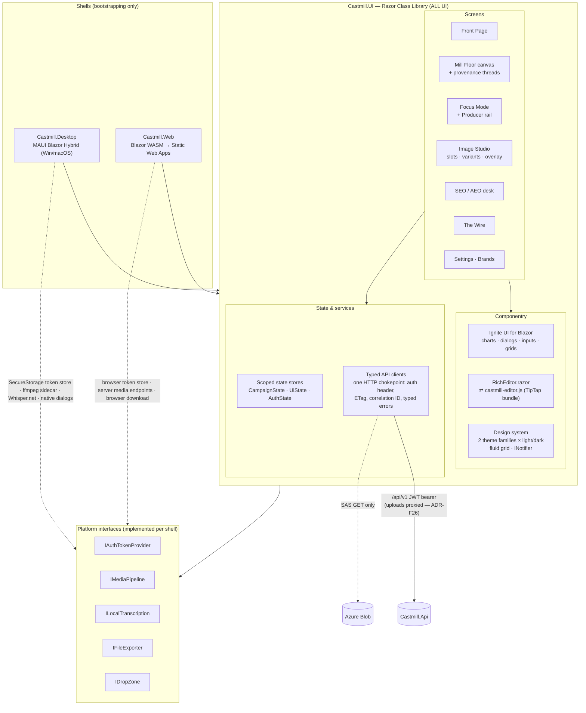

# Castmill Frontend — Architecture

> **Doc conventions.** Same format as the backend doc (Azure Architecture Center reference-architecture structure; decisions as ADRs; considerations mapped to Well-Architected pillars; docs-as-code, updated in the same PR as the change).
>
> Companion docs: [Backend-Architecture.md](Backend-Architecture.md) · [Roadmap-Blazor.md](Roadmap-Blazor.md) · design reference: [Mill Floor handoff](docs/design_handoff_castmill_mill_floor/README.md)

---

## 1. Overview

The Castmill client is **one Blazor codebase shipped through two shells**: a .NET MAUI Blazor Hybrid desktop app (Windows + macOS) and a Blazor WebAssembly web app hosted on Azure Static Web Apps. Every page, component, style, and service lives in a shared Razor Class Library (`Castmill.UI`); the shells contain only bootstrapping and platform-service implementations behind a small set of interfaces.

Component strategy: **Ignite UI for Blazor** (MIT tier) for structured surfaces (dialogs, tabs, inputs, toasts, trees); **Blazor-ApexCharts** for every chart (ADR-F24); **custom Razor + CSS** for the differentiated "Mill" UX (Front Page, Mill Floor canvas, Focus Mode, Image Studio, The Wire); and exactly **one JS-interop component that matters** — the markdown editor.

**Navigation model (ADR-F11/F35).** Two scopes, kept separate: the left rail is *workspace* scope — Front page · Campaigns · The Wire, followed by one complete, metadata-bearing campaign switcher. The campaign's four views — **Mill Floor · Focus mode · Image studio · SEO analysis** — are a segmented tab strip on the persistent campaign header, never rail items. Switching campaign keeps the current view.

**Layout is fluid (ADR-F10).** The design prototypes are drawn on a fixed 1440 × 880 canvas; that is a drawing convention, not the product. Every surface is implemented against a fluid grid with named breakpoints and no page-level horizontal scroll.

**Two theme families (ADR-F09).** *Warm Editorial* (the brand sheet: ivory/terracotta/serif) and *Industry Blueprint* (the handoff sheet: steel-blue/Barlow/square corners), each in light and dark, switchable at runtime.

## 2. Goals & non-goals

### Goals
| # | Goal | Measure |
|---|---|---|
| G1 | **One UI codebase, two shells** | Zero `.razor` files outside `Castmill.UI`; enforced by CI check |
| G2 | **The editor contract is markdown-only** | Markdown string in → markdown string out; no HTML or editor-JSON ever persisted; CI-gated round-trip suite |
| G3 | **Desktop-only features degrade gracefully on web** | Feature flags per capability; web never renders a dead control |
| G4 | **The Mill UX performs** | Canvas: 60 fps pan/zoom with 100 cards on WASM; Front Page < 1 s on seeded data |
| G5 | **Keyboard-first** | Entire review flow operable via ⌘K + keyboard; visible focus states everywhere |
| G6 | **Two theme families, four modes, all first-class** | Warm Editorial + Industry Blueprint × light + dark; every token defined in all four; runtime switcher persisted per device; WCAG AA text contrast verified in all four |
| G7 | **JS is quarantined** | JS interop limited to: editor bundle, clipboard, file download, localStorage — each behind a .NET interface |
| G8 | **Fluid, responsive layout** | No fixed-pixel page canvas. Fluid from **1024 px to ultrawide**; rail collapses to icons < 1180 px and to an overlay < 900 px; no page-level horizontal scroll at any width (wide content — the swimlane board, keyword tables — scrolls inside its own region); min supported height 700 px with no clipped chrome |
| G9 | **Image state is never invisible** | Empty image slots are visible on the front page, the campaign header counter, and the Focus Mode slot list — all from one `Preview` payload |

### Non-goals (v1)
- No real-time co-editing or presence.
- No offline-first sync (desktop caches nothing beyond per-device UI state).
- No URL deep-link contract beyond campaign/artifact routes (share links are a v2 concern).
- No mobile shells.

## 3. Architecture

### Dataflow (canonical interaction: review a generated blog)
1. Front Page's "Ready for review" lists artifacts from the campaign `Preview` projection (small payload, G4).
2. Selecting the card opens Focus Mode; the full artifact loads with its ETag; the markdown string is handed to `RichEditor.razor` → `castmill-editor.js` renders it.
3. Edits stay in the editor; on blur, `getMarkdown()` returns the string and the store issues a conditional `PUT` (`If-Match: <etag>`); a 412 surfaces a friendly conflict prompt.
4. Steering from the Producer rail calls the AI endpoint; the returned markdown **fully replaces** editor content (no streaming, per backend ADR-006); the prior take is already an `ArtifactRevision` server-side (backend ADR-017), so the version filmstrip lists revisions and restores through the API — it is no longer client-local.
5. Provenance: citation segment IDs on the artifact resolve against the campaign's timed transcript; hover renders the thread/underlines from data already in the store — no extra round-trips.
6. Image state travels in the same `Preview` payload as the artifact list: slot kind, target dimensions, state, published URL. One fetch feeds the header's `n/6` counter, the front page's "slots waiting" block, and Focus Mode's slot list (G9) — no separate polling per surface.

## 4. Components

| Component | Responsibility | Key constraint |
|---|---|---|
| **Shells** | DI registration of platform services, per-shell token storage (`SecureStorage` / browser storage), window/host chrome | No UI; CI enforces G1 |
| **Design system** (`UI/Design`) | **Two token families** as CSS custom properties — *Warm Editorial* (paper/ink/ember/brass/sage/panel/rule, serif display) and *Industry Blueprint* (bg/surface/text/accent ramp, Barlow Condensed, radius 0, registration-mark frames) — each with light + dark; runtime `ThemeService` switcher persisted in `UiState`; Ignite UI theme mapping per family; shared **semantic** layer (status colours, type scale, spacing scale, motion spec 200 ms ease-out); fluid grid + breakpoint mixins; `INotifier`, confirm service, empty states | Feature CSS consumes **semantic** tokens only — never a family's raw colour and never a literal; adding a third family must require no feature-CSS edits |
| **Layout system** (`UI/Design/Layout`) | Fluid app grid (rail + content), breakpoints `sm 900 / md 1180 / lg 1440 / xl 1920`, rail collapse behaviour, content max-widths (manuscript ~72 ch, dashboards 1600 px capped and centred), per-region scroll containers, density toggle (comfortable / compact) | G8: no page-level horizontal scroll at any width; nothing positioned by absolute pixel offset except the provenance thread overlay |
| **State stores** | Scoped (per-circuit/per-app) plain C# classes with change events; `CampaignState` (campaign + artifacts + transcript), `UiState` (per-device, persisted to localStorage via interop), `AuthState` | No global static state; stores are the only writers |
| **Typed API clients** | One `DelegatingHandler` chokepoint: bearer token via `IAuthTokenProvider`, correlation ID, ETag capture, typed error envelope (`ApiError`, `UnauthorizedError`, `ConflictError`) | UI never touches `HttpClient` directly |
| **RichEditor** | `RichEditor.razor` + esbuild-bundled `castmill-editor.js` (TipTap core, markdown bridge with lettered-list tokenizer disabled, slash menu, bubble menu); blur-commit; outline rail as Blazor sibling fed by heading events | Markdown-only contract (G2); bundle < 250 KB gzip; no framework runtime in the bundle |
| **Campaign header** | Persistent on all four campaign views: breadcrumb + campaign name, image counter, segmented view tabs as real `<button>`s | Tabs are keyboard-reachable with visible `:focus-visible` rings (G5); the header re-renders from the selected campaign — every campaign-scoped surface must, since "header changed, content didn't" was the prototype's most common bug |
| **Mill Floor canvas** | Virtualized swimlane storyboard (YouTube · Blog · Social · Email · Clips · Page), Source Master card with timed transcript, CSS-transform pan/zoom (no re-layout), status expressed as both a 3 px left bar **and** the warm glow ring per theme family, provenance thread overlay (SVG), Press Run print-in animation driven by `/ai/runs/{id}` completions | G4 budget; respects `prefers-reduced-motion`; the board scrolls inside its own region, never the page (G8) |
| **Provenance overlay** | One SVG per canvas region; cubic path per cited segment from segment-row right edge to card left edge, source dot + monospace segment label, cited rows highlighted; hover = transient, click = pinned, mouse-out restores the pinned set | The only component allowed to measure pixels (`getBoundingClientRect`); must recompute on scroll, zoom, resize and theme change, and re-measure on `ResizeObserver` rather than assuming a fixed canvas (G8) |
| **Image Studio** | Fourth campaign view, laid out as a **contact sheet + editor drawer** (ADR-F43): per-content-piece rows of slot tiles at their true aspect ratios (published image when filled, dashed hole when empty, shared ADR-F12 status encoding, ghost "add image" tile per row); selecting a tile opens the editor drawer — model radio group with per-provider readiness from `/ai/status`, provenance-labelled prompt textarea + constraint chips, variant count, reference picker, thumbnail headline field with safe-area preview, variant tiles → take lightbox → place into slot | Skeleton tiles, never spinners; the headline preview must render the same geometry the server compositor applies (backend B9.3), and cost estimate updates with variants × model; the take lightbox (`.cm-modal`, z 70) stacks above the drawer (z 60) |
| **SEO / AEO desk** | Deep scorecards, keyword/authority charts via Blazor-ApexCharts, report tables and content angles; the campaign content hierarchy is ApexTree, lazy-loaded through its own interop asset | **Honesty rule:** measured inputs and predicted outcomes are labelled separately; unavailable provider sections say why |
| **The Wire** | Week × channel grid, drag-to-schedule (pointer events, not HTML5 DnD — must work in WebView2/WKWebView), platform preview with char meters; loads from `/schedule` (backend ADR-016), so it renders before any broker call | Meters computed from shared `Castmill.Core` limits table |
| **Platform services** | See interface table in [Roadmap-Blazor.md](Roadmap-Blazor.md) §2.2 | Web implementations must exist for every interface, even if the implementation is "feature-flagged off" (G3) |
| **editor-interop** (npm project) | esbuild → independently lazy-loaded editor and ApexTree static assets in the RCL; vitest round-trip suite | The only npm dependency surface in the product; versions pinned; the editor bundle retains its independent size budget |

## 5. Design decisions (ADR log)

| ADR | Decision | Rationale | Revisit when |
|---|---|---|---|
| ADR-F01 | All UI in one RCL; shells are bootstrap-only | Two shells that can't drift; one test surface | A shell needs genuinely different UX (mobile) |
| ADR-F02 | Ignite UI for structured surfaces, custom Razor for the Mill UX | Component library where it accelerates; no fighting it where the UX is the product | — |
| ADR-F03 | Markdown-only editor contract via one TipTap interop bundle | Ignite UI has no RTE; markdown keeps every export/persist path trivial and the editor swappable | A .NET-native editor reaches feature parity |
| ADR-F04 | Plain C# state stores over a state-management library | Blazor DI + change events cover the need; fewer concepts | Cross-store orchestration gets tangled |
| ADR-F05 | Pointer-event drag-drop, not HTML5 DnD | HTML5 DnD is unreliable across WebView2/WKWebView/browsers; pointer events are one code path | — |
| ADR-F06 | Per-device UI state in localStorage; everything else server-persisted | Pane/zoom prefs are ergonomics; settings must roam | — |
| ADR-F07 | Blazor Router with campaign/artifact routes from day one | Web deep links cheap now, expensive later; desktop ignores the URL bar | — |
| ADR-F08 | WASM ships with AOT + trimming; measure before adding more | G4 on the canvas; AOT first, exotic optimizations only on evidence | — |
| ADR-F09 | **Two theme families shipped together** — Warm Editorial (default) and Industry Blueprint — each light + dark, with a runtime switcher; feature CSS binds to a shared semantic token layer | Both explorations are good and they suit different users; the handoff explicitly leaves the choice open. A semantic layer costs one indirection now and removes the need to ever pick — and proves the token architecture actually works, which a single sheet never does | A third family, or telemetry showing one family unused |
| ADR-F10 | **Fluid responsive layout**; the design's fixed 1440 × 880 canvas is treated as a drawing convention, not a spec | Real windows are not 1440 px, MAUI desktop windows are resizable, and the pixel values in the handoff are ratios worth keeping rather than absolutes worth freezing. Fixed-width would also break the desktop shell's window chrome | Someone ships a fixed-size kiosk build |
| ADR-F11 | **Rail = workspace scope, header tabs = campaign scope**; the four campaign views are never rail items | Keeps "where am I" answerable at a glance and makes campaign switching orthogonal to view switching (switching campaign keeps the view). Adopted wholesale from the handoff | The app grows a second scope level (e.g. workspaces) |
| ADR-F12 | **Status is encoded twice, consistently** — a 3 px left bar *and* the family's status colour (glow ring in Warm Editorial, flat bar in Industry Blueprint) | The bar carries the state at swimlane zoom-out where a glow ring is illegible; both readings use the same four states (draft → in review → queued → published), so no surface invents its own | A fifth artifact state appears |
| ADR-F13 | **No indeterminate spinners anywhere.** Transcription = progress bar + narrated log; generation = card-by-card Press Run reveal; images = pulsing skeleton tiles | Every long operation here has real granularity available (per-step, per-artifact, per-variant), so a spinner is strictly less information; this is also the product's most distinctive motion | An operation genuinely has no observable progress |
| ADR-F14 | **Version filmstrip reads server revisions**, not client-local takes | Restore must survive reload and roam between shells; pairs with backend ADR-017. Supersedes the client-local note in the original §3 dataflow | — |
| ADR-F15 | **Ignite UI MIT tier** — `IgniteUI.Blazor.Lite` + `IgniteUI.Blazor.GridLite` — is the default dependency; the commercial suite is deferred until a surface actually needs it | The MIT tier covers every component in the Roadmap §2.6 usage map except the charts: Dialog, Tabs, Inputs, Select, Combo, Stepper, Tree, Card, Chip, Avatar, Badge, Radio, DatePicker, Splitter, Toast/Snackbar are all present. It needs no private feed and no licence key, so the repo keeps its zero-secret property and CI needs no credential. Only `IgbCategoryChart` on the SEO desk (E9.2 / F9) requires the licensed package | F9 reaches the SEO desk charts — then add the licensed feed deliberately, with its credential outside the repo |
| ADR-F16 | Ignite UI's **theme stylesheet is imported by the design system's own CSS**, not linked from each shell's host page | Ignite UI components keep their styles in shadow roots but resolve every colour, size and elevation from `--ig-*` custom properties that only a theme stylesheet defines; without one they upgrade correctly and render completely unstyled, which is a silent failure. Importing from the RCL's stylesheet gives one source of truth, so the two shells cannot drift on theming — the failure mode G1 exists to prevent, in CSS rather than Razor | F1 replaces the single global import with per-family mapping driven by `ThemeService` (story 3.2) |
| ADR-F17 | Each shell owns exactly one stylesheet — `wwwroot/css/host.css` — scoped to **pre-startup boot chrome and Blazor's error bar**, and nothing else | Those pixels are painted before any .NET code runs and differ legitimately per shell, so they cannot live in the RCL. Fencing them into one named file per shell keeps the exception auditable: a bUnit test asserts no component-scoped `.razor.css` ever appears in a shell project | A shell needs startup chrome complex enough to warrant its own component (it would then belong in the RCL behind a capability flag) |
| ADR-F18 | **The Blueprint family uses radius 0**, not the 2/4/7 px in the prototype's own `_ds/styles.css` | The handoff README and roadmap §1.2 both specify square corners with `+` registration frames for this family; the 2/4/7 values are the upstream Industry design-system defaults the prototype inherited, not a decision about Castmill. The authoritative docs win, and this is recorded so the discrepancy is not "fixed" back later | The Blueprint sheet is revised upstream with corners as an explicit choice |
| ADR-F19 | **G6 and G8 are enforced by test, not by review** — `DesignTokenTests` computes WCAG ratios for every text pair across all four family × mode combinations, asserts both families define an identical token set, forbids `--cmf-*` or colour literals outside `tokens/`, and checks the breakpoint tokens still match the media queries | A style-guide review cannot catch a contrast regression in the one combination nobody clicked, and "feature CSS uses semantic tokens only" is a rule that decays the moment it depends on reviewer memory. Writing the two gates as tests found two real AA failures on the first run | A tool does this better — e.g. the Infragistics theming MCP as a CI step |
| ADR-F20 | **Ignite UI is themed by overriding its eight base palette keys**, not by restyling components | Ignite UI derives every ramp from `--ig-{primary,secondary,gray,surface,info,success,warn,error}-500` with relative-colour syntax, and computes its own accessible `-contrast` foregrounds from them (measured: 4.97:1 on our terracotta). So the mapping is ~20 lines feeding it our tokens, and component internals stay the library's business. Corner radius is the exception — this version bakes it per component, so the Blueprint family sets `border-radius: 0` on an explicit list of adopted elements | Ignite UI exposes a global radius factor, or a component resists the palette |
| ADR-F21 | **State stores are single-flight per key**, and the guard is a plain field set *before* the async method starts | Components call `LoadAsync` from `OnParametersSetAsync`, which runs on every re-render, and a store's `Changed` event *causes* re-renders. A load that re-enters while in flight therefore notifies → re-renders → loads again, without bound: a hung tab, not a slow one. Found in the browser during F3, after bUnit had passed — a stubbed transport completes before any re-render, so the loop is invisible to it. The first guard still recursed because an `async` method runs synchronously up to its first `await`, so the task field was not yet assigned when the notification fired; the working guard tests the *id/bool* set before the call. `StoreSingleFlightTests` uses a gated transport, the only way to express re-entrancy at all | A store gains a queue of pending keys rather than one |
| ADR-F22 | **Artifacts carry a server-side `Status`** — Draft → InReview → Queued → Published — changed through a dedicated ETag-guarded `PATCH /status`, not as part of a content save | ADR-F12's double encoding, the Front Page's review queue, the review gate and the Wire's queue are all built on artifact state, and the entity had no such column: F3's central surface would have been fiction. Keeping the transition off the content save matters because "mark reviewed" and "edit the copy" are different intents with different guards (roadmap E6.9). Stored as a string so the set can grow without a migration | A fifth state appears, or transitions need to be role-gated |
| ADR-F23 | **Images are an inline node in the editor schema**, not a block node | As a block node, an image serializes with no trailing blank line, so `` immediately followed by a list came back out as one joined line — and the next round trip escaped the `-`, silently corrupting the list. As an inline node the image sits in a paragraph and the paragraph serializer handles separation, which is also how CommonMark represents a standalone figure. Caught by the round-trip corpus on its first run, which is the argument for the corpus existing | The schema needs figure/caption as a real block structure |
| ADR-F24 | **Charts are Blazor-ApexCharts** (the official ApexCharts Blazor wrapper, free for Blazor use — <https://apexcharts.com/docs/blazor-charts/>), not `IgbCategoryChart` | Supersedes the chart clause of ADR-F15: the SEO desk's share-of-voice bars were the one surface that required the commercial Ignite UI package, and ApexCharts' Blazor exception removes that need entirely — the whole client now ships on free, licence-clean dependencies with no private feed, ever. The MIT Ignite UI tier remains the component library for everything §2.6 lists; ApexCharts is charts only. Owner's decision, 2026-07-30 | ApexCharts' Blazor licensing changes, or a chart need it cannot cover |
| ADR-F25 | **Store `Changed` handlers must dispatch through `StoreEvents.GuardedAsync`** (or `DetachedAsync` for fire-and-forget); enforced by a source-scan test, not review | A throw inside `InvokeAsync(async () => …)` from a store event is a dispatcher fault, which **bypasses every ErrorBoundary** and lands on Blazor's global error UI — the whole app dies for one component's exception. bUnit cannot cover it (its renderer rethrows into the test), so `StoreEventGuardTests` scans the Razor source and fails the build on the next unguarded handler. Two sibling source-scan gates were added for the same reason — browser-fatal, test-framework-invisible: `RazorMarkupSanityTests` (a Razor `@* *@` comment inside an attribute list emits as an attribute name → `InvalidCharacterError`, blank app) and `CssSelectorCollisionTests` (same-selector rules merge across files via the import cascade; a duplicate silently rewrites another feature's layout) | The renderer surfaces dispatcher faults to ErrorBoundary upstream |
| ADR-F26 | **Client uploads are proxied through the API** (`POST /api/v1/blob/assets/{id}/content`, `ByteArrayContent`); SAS is read-only from the client's perspective | Direct browser→blob SAS PUT failed twice over: the storage account needs a CORS rule per origin (an Azure-side action per environment), and Mac Catalyst's `NSUrlSessionHandler` fails chunked `StreamContent` bodies outright. One proxy endpoint works identically in both shells and keeps G2's no-key-material posture (the API already held the write path). Buffered `ByteArrayContent` because the transfers are asset-sized, not media-sized — large media still goes through B6's resumable path | Web upload volume makes proxying a measurable API cost — then revisit SAS PUT with per-environment CORS baked into Bicep |
| ADR-F27 | **Token custody is memory-authoritative**: `TokenProviderBase` holds the refresh token in memory as the first-class copy; persistent storage exists only so a session survives an app restart. On desktop, persistence is SecureStorage **with a user-only (0600) file fallback** — dev builds cannot use the Keychain at all. Only a definitive 401 from the refresh endpoint clears the session; the client `HttpClient` timeout is 10 minutes | The Mac Catalyst build shipped with an empty `Entitlements.plist` — MAUI SecureStorage **requires** `keychain-access-groups` there and throws on every write without it. The desktop provider swallowed the throw, refresh depended entirely on storage, and every desktop session died exactly 15 minutes after sign-in (DB evidence: zero server-side revocations, endless fresh logins). Adding the entitlement is not the dev-build fix: it is a *restricted* entitlement, and an ad-hoc-signed Debug build carrying it is **killed by launchd at spawn** (no codesigning identity exists on the dev machine). So: live sessions never depend on storage (memory-authoritative); restart survival on dev builds comes from a 0600 file holding only the rotating single-use refresh token (the az/gh CLI posture); and a properly signed build (E10.4 packaging) carries the entitlement, at which point SecureStorage validates and the provider prefers it automatically. `ShellLayout` turns a session that does end mid-flight into one redirect + one message instead of app-wide error soup. The 10-minute timeout exists because .NET's 100 s default aborted 123 s image generations mid-silent-refresh, orphaning the just-rotated single-use token. Pinned by `TokenRefreshResilienceTests`, including a verbatim replay of the keychain outage | E10.4 ships the signed pkg — then verify SecureStorage takes over and consider deleting the fallback path |
| ADR-F28 | **Focus Producer and Image Studio are content-item scoped.** Focus shows steering, regeneration, images and blog publishing metadata for the open artifact only. Image Studio's left rail is content first, with that item's image cards beneath it; deep links can select an artifact or slot. Each card exposes auto/manual prompt mode, real brand references, automatic product screenshots, and thumbnail concept selection before generation | A campaign-wide Producer visually attached controls to the selected post while operating on unrelated campaign state. Content-first grouping makes ownership visible, supports “add an image to this X post,” and prevents a sibling post's image from being inserted by accident | Cross-item asset reuse needs an explicit copy/link action rather than weakening ownership |
| ADR-F29 | **The creation flow is Source → Transcript → research Context → full SEO/AEO Report → SEO-informed Production brief → Press Run.** The context stage AI-infers an editable research audience, inherits read-only voice from the selected Brand, collects a required site URL, and generates no content. The report stage renders AEO engine cards/citations, keyword demand/intent and gaps, existing rankings, authority/competitor charts, SERP/zero-click surfaces, questions, recommendations and content angles before presenting editable targets for approval. Only after approval does Castmill ask AI to draft the production angle/summary and expose fan-out choices. The SEO desk reuses the same report component; blog head metadata and JSON-LD remain on that blog's Focus Producer | A keyword picker is not a strategic analysis, and a transcript-drafted brief before SEO still makes research corrective. The visible sequence now matches the backend gate literally: analysis informs the brief, which informs titles and content. One shared report component prevents the initial decision surface and the later desk from telling different stories | Campaign types that intentionally do not target discovery require a designed waiver state |
| ADR-F30 | **Data charts use Blazor-ApexCharts; content relationships use ApexTree.** The hand-drawn radial cluster SVG is replaced by a lazy-loaded ApexTree hierarchy with the pillar as root, artifact and missing-channel leaves, stable IDs, accessible keyboard navigation, pan/zoom and click callbacks into typed Blazor actions | Quantitative comparison and hierarchical ownership are different visual problems. ApexCharts remains the right grammar for metrics, while ApexTree communicates parent/child structure and scales beyond a fixed ring without custom geometry | The artifact model gains several relationship types that require a graph rather than a tree |
| ADR-F31 | **The Context voice field is a read-only projection of the Brand picker.** Selecting a Brand copies its style-card voice into the campaign context immediately; selecting None clears it. Audience has a dedicated automatic transcript-inference call plus explicit regenerate/edit affordances | A second editable voice creates conflicting sources of truth and lets the campaign silently drift from the Brand that every server-side generator already resolves. Audience inference is useful before SEO, but must remain reviewable because it shapes metered research | Per-campaign voice exceptions become a deliberate product feature with an explicit override state |
| ADR-F32 | **Focus mirrors durable content ownership.** Pillar blogs are accordion roots with owned social/email children, availability dots, approval checks and counts; the Producer remains scoped to the selected item. Campaign-wide artifacts stay in a separate root. The header edits campaign name/status in place, transcript rows name their source file, and blog/YouTube Producers show the exact report evidence that grounded them | A lane-only list hides which campaign assets belong together, and campaign-wide controls recreate the ambiguity ADR-F28 removed from images. Durable hierarchy plus honest report empty states make generation, review and deletion predictable | Cross-pillar reuse becomes common enough to need explicit linked/duplicated child actions |
| ADR-F33 | **Image controls are local, stateful interactions and AEO answers use a single focused reading surface.** Image Studio prompt-mode and constraint changes patch the selected slot without refreshing campaign state; chips expose literal ARIA pressed state and strong selected styling; the content rail reserves its own footer for add-image. Brand asset cards expose type reclassification on hover/focus. AEO engines are full-width tabs feeding one sanitized-Markdown panel | These actions edit one durable row and should not reset the editor around it. Explicit state prevents ambiguous chips, while a single wide response preserves Markdown hierarchy and makes long AI answers readable instead of squeezing four prose cards into columns | Image Studio gains multi-select/bulk operations, or AEO reports need side-by-side engine comparison as a separate mode |
| ADR-F34 | **Focus navigation is a vertical Mill Floor projection, not an ownership/status diagnostic.** Its non-interactive category bands use the canonical lane order and alternate accent; content rows alone select the manuscript and expose the same trash-can deletion language as Mill Floor. Operational artifacts resolve as non-editable and stale links fall back to the first real content item | Blog accordions, social-availability chips and a campaign-wide catch-all made labels look selectable, hid content behind disclosure state, and placed social posts under an ownership bucket instead of their Mill Floor category. Navigation should answer “what can I edit?” with the same taxonomy the board already taught | Cross-lane ownership becomes important enough to warrant a separate hierarchy view rather than overloading Focus navigation |
| ADR-F35 | **The workspace rail has one complete Campaigns list.** It does not repeat the active campaign in a separate card or collapse larger workspaces to a recent subset. Each switch row carries name, date added, update recency, active state and the standard hover/focus trash-can delete action; the rail itself owns overflow | Duplicating the active campaign made one workspace appear to be two navigation concepts, while truncating the primary switcher hid valid campaigns. The existing scroll container can present the complete list without a second index handoff | Campaign volume or server pagination becomes large enough to require a virtualized/searchable switcher while preserving complete discoverability |
| ADR-F36 | **Brand Templates are full-screen working documents and YouTube is first-class.** The Templates tab opens on YouTube, explains that the text is the primary AI content brief, supports 20,000 characters, and lets the editor consume the remaining viewport height with a scrollable/resizable fallback on narrow or short screens | A small textarea visually presented a consequential generation contract as optional metadata, while omitting YouTube blocked the product's founding artifact from Brand-specific strategy. The layout should communicate the template's actual weight in generation | Templates gain structured fields, comparison/versioning, or side-by-side generated previews |
| ADR-F37 | **Content-type surfaces are projections of one explicit role registry.** The thirteen user-generatable kinds drive New Campaign, Mill Floor's Print more menu and Brand Templates; a separate distribution role feeds Image Studio, the ApexTree topic cluster and The Wire. Campaign format is persistent navigation context in the header, index and workspace switcher | Independent hard-coded lists hid Clip Suggestions, exposed Campaign Summary as a generator and let internal strategy documents masquerade as image or publishing work. Generation, editing, visual production and distribution are distinct roles even when they share one artifact table | Plugin-defined artifact kinds require a server-delivered registry rather than the current shared compiled contract |
| ADR-F38 | **Clipboard writes go through one cross-shell service.** Its JavaScript island tries the asynchronous Clipboard API and falls back to a temporary selected textarea plus `execCommand('copy')`; transcript and SEO copy actions consume only that service | Calling `navigator.clipboard.writeText` directly from Razor failed in embedded WebViews and permission-restricted contexts even when the button had a valid user gesture. Keeping both attempts inside one JavaScript turn preserves user activation, gives Web and Desktop identical behavior and makes component tests independent of JS interop | The embedded platforms expose a native clipboard API worth adopting behind the same interface |
| ADR-F39 | **Persisted SEO analysis has exactly one UI destination: SEO Analysis; the legacy SEO Brief has none.** `seo-report` and legacy `seo-keyword-plan` are system analysis artifacts rendered only by the SEO Analysis tab. Legacy `seo-brief` is an internal, non-visible research pass. All three are non-board and non-editable kinds and never enter New Campaign choices, Print more, Mill Floor, Focus navigation, Brand Templates or dashboard work queues | A generated research intermediate was presented beside Landing Page as though it were campaign copy, creating a cramped Page/SEO lane and contradicting the analysis-first workflow. Research informs production; it is not itself a Mill deliverable | SEO Analysis gains separately editable strategy documents that need explicit sub-tabs rather than reuse of Focus |
| ADR-F40 | **Entering Focus selects the first visible content row in canonical lane order.** A valid `?artifact=` deep link wins; otherwise the selected id must still belong to the current campaign, then Focus falls back to the first displayed row (YouTube first when present). Route changes clear prior-campaign selection | The rail was grouped in lane order while fallback selection used raw API order and could retain an id from a reused page instance. The highlighted row and manuscript must describe the same deterministic item on every entry | Focus gains a persisted per-user “last opened item” preference that intentionally supersedes first-row selection |
| ADR-F41 | **The production board has a Page lane, never Page/SEO.** Landing pages are Mill deliverables; SEO reports and plans use the separate, non-board `SEO Analysis` role from ADR-F39 | Once research left the Mill, retaining `/SEO` in the only remaining landing-page lane falsely implied that analysis artifacts belonged there and consumed scarce lane-label width | Another publishable page kind needs its own category rather than the shared Page lane |
| ADR-F42 | **Image Studio shows source-copy context beside controls and inside the take dialog.** Selecting an artifact-owned slot fetches only that artifact and renders an excerpt from its actual content; inline blog slots prefer prose surrounding their stub marker. A slot-id guard discards stale responses after rapid selection changes | An AI image description explains the proposed visual but not which claim or passage it supports. Showing the manuscript's own words lets a producer judge relevance while keeping campaign previews small and avoiding a second AI summary | Editors need to choose and persist an exact arbitrary passage rather than deriving context from the slot marker |
| ADR-F43 | **Image Studio is a contact sheet with an editor drawer, not a nav rail + permanent pane.** The canvas renders every content piece's slots as tiles at their true aspect ratios — the published image when filled, a dashed hole when empty, `Rendering` while a run is live — using the shared ADR-F12 status encoding; "add image" is a ghost tile at the end of the piece's own row. Selecting a tile opens the editor as a closable drawer beside the sheet (sticky column ≥ 60 rem, fixed edge overlay below it; Escape and a close button dismiss it; the take lightbox stacks above at z 70 > 60), and the selection is mirrored to `?slot=` so deep links, refreshes and cross-view jumps still open the right slot. Nothing auto-selects on entry — the default view is the whole plan (supersedes ADR-F28's left-rail layout; item ownership and content-first grouping from that ADR stand) | The rail spent four layers of boxed chrome per content piece before showing content, encoded state as a text badge invisible at a glance, and a permanently open editor hid the plan it was editing. Aspect-true tiles make coverage visible — empty tiles *are* the missing images — and the drawer keeps the whole campaign in view while one slot is worked | Campaigns grow past what a tile sheet can scan, or bulk slot operations need a persistent list-selection model |

## 6. Considerations — Well-Architected pillars (client lens)

- **Security.** Email/password sign-in against `/api/v1/auth` (ADR-010 in the backend doc); access JWT held in memory by the chokepoint handler; rotating refresh token held **in memory as the authoritative copy** (ADR-F27) and persisted to OS-protected `SecureStorage` on desktop (requires the `keychain-access-groups` entitlement on Mac Catalyst) / browser storage on web for restart survival; passwords never persisted client-side; no secrets in client config; CSP on SWA (no `unsafe-*` beyond wasm-eval); external links open via `IExternalLinkOpener` only; pasted/AI content rendered through the sanitizing Markdig path.
- **Reliability.** Typed error envelope with actionable messages; 412 conflict UX (reload/merge prompt); blur-commit means at most one keystroke-burst of unsaved work; web upload resumable.
- **Performance efficiency.** Preview projections for lists — one payload carries artifacts *and* image-slot state (G9); canvas virtualization + transform-only pan/zoom; provenance overlay measures on `ResizeObserver`/scroll rather than per frame; lazy-load heavy views (charts, editor bundle, Image Studio); AOT (ADR-F08); target budgets in G4 measured in CI Playwright runs.
- **Cost optimization.** SWA free/standard tier; no client-side AI spend; image previews served as cached WebP from the public container; the Image Studio shows a live cost estimate (variants × model) *before* generating, and headline edits re-composite server-side instead of re-generating (backend ADR-013).
- **Accessibility.** All four theme × mode combinations verified AA on text (G6); view tabs are real buttons with `:focus-visible` rings (G5); status never carried by colour alone (ADR-F12); `prefers-reduced-motion` disables the Press Run reveal and the skeleton pulse, falling back to a plain narrated log; layout is fluid so 200 % browser zoom behaves like a narrow breakpoint rather than clipping (G8).
- **Operational excellence.** Correlation ID from the chokepoint into every API call; client telemetry (page timing, API timing) to App Insights; living style-guide route; this doc + ADRs updated in-PR.

## 7. Phased backlog

**Contract for every phase:** committed, CI-green, and *demonstrable in both shells* (or explicitly flagged desktop-/web-only per G3). Frontend phases interleave with backend phases (noted as `needs B*` from [Backend-Architecture.md](Backend-Architecture.md) §7).

### Phase F0 — Shells & walking skeleton *(size S · needs B0)* — ✅ complete 2026-07-29
- `Castmill.UI` RCL + both shells render one shared page with one Ignite UI component; editor-interop npm project scaffolded with esbuild emitting to RCL wwwroot.
- CI: build both shells, run bUnit + vitest placeholders; the G1 "no UI outside the RCL" check.
- **Check-in gate:** same page pixel-identical in MAUI and WASM; CI enforces G1.
- *Delivered:* `Castmill.UI` (App root, ShellLayout, Skeleton page, `IShellInfo` seam, `AddCastmillUi`), `Castmill.Web` (WASM, bootstrap-only), `Castmill.Desktop` (MAUI Blazor Hybrid, Mac Catalyst + Windows-on-Windows), `src/editor-interop` (esbuild → RCL wwwroot, gitignored output), `tests/Castmill.UI.Tests` (bUnit 2.8.6 + xUnit v3, 7 tests), `tests/editor-interop` (vitest, 4 tests). CI splits into ubuntu (solution filter) + macos (MAUI) jobs because the MAUI targets cannot build on Linux.
- *G1 is enforced by test, not script* (`UiBoundaryTests`), so it runs in every local `dotnet test` without Docker: no `.razor` outside the RCL, no component-scoped CSS in either shell.
- *Verified:* 80/80 backend + 7/7 bUnit + 4/4 vitest green on the GA band; web shell driven in headless Chrome — all four Ignite UI custom elements upgraded with shadow roots, click handler round-trips through `igc-button`, runtime reports .NET 10.0.10, no page-level horizontal scroll, zero console errors and zero failed requests. Desktop shell builds, launches, and mounts the same `Castmill.UI.App` from the same RCL stylesheet; **its rendering was confirmed by eye, not by an automated screenshot** — the shells-look-identical claim is mechanically covered only from F9's CI screenshot matrix (story 10.6).
- *Deliberately deferred:* Ignite UI theming is a single global import of the reference `material` theme with no design intent (ADR-F16); the markdown bridge is an identity stub (F4); `Castmill.*.styles.css` links are commented out in both hosts until the first `.razor.css` exists in F1. **Mac Catalyst ignores the MAUI `Window` `Width`/`Height`** — it honours `MinimumWidth`/`MinimumHeight` and opened at 1024 × 768; revisit if a specific default window size matters.

### Phase F1 — Design system *(size M→L · parallel with B1–B2)* — ✅ complete 2026-07-29
- **Semantic token layer** first (surface/on-surface/accent/status/rule, type roles, spacing scale, motion), then the two families behind it: *Warm Editorial* (ivory/terracotta/serif, paper-grain overlay) and *Industry Blueprint* (steel-blue ramp, Barlow Condensed, radius 0, `+` registration-mark frames, duotone media treatment) — each light + dark (ADR-F09).
- **Theme switcher**: `ThemeService` (family × mode), persisted per device in `UiState`, honours `prefers-color-scheme` on first run; switching is a class swap on the root — no reload, no flash, and the provenance overlay re-measures on change.
- **Layout system** (ADR-F10, G8): fluid app grid, breakpoints `sm 900 / md 1180 / lg 1440 / xl 1920`, rail collapse (icons < 1180, overlay < 900), content max-widths, per-region scroll containers, comfortable/compact density toggle.
- Ignite UI theme mapping **per family**; type scale + motion spec; `INotifier` toasts, confirm dialogs, empty states; living style-guide route (dev-only) with family × mode × breakpoint switchers side by side.
- **Check-in gate:** style guide reviewed; AA contrast verified in all four family × mode combinations (G6) — the Ignite UI theming MCP validates contrast; Igb components visually indistinguishable from custom chrome in both families; style guide shows no page-level horizontal scroll from 1024 px to 2560 px (G8).
- *Delivered:* `wwwroot/css/tokens/` (semantic layer + both families × light/dark), `base.css` (self-hosted OFL faces + shared type roles), `layout.css`, `components.css`; `Design/` — `ThemeService`, `IUiStateStore` + `BrowserUiStateStore`, `INotifier`/`Notifier` + `NotificationHost`, `IConfirmService`/`ConfirmService` + `ConfirmHost`, `EmptyState`, `ThemeSwitcher`; the dev-only `/dev/style-guide` route. **Five typefaces self-hosted** (Source Serif 4, Inter, Barlow, Barlow Condensed, IBM Plex Mono — 272 KB latin woff2, OFL 1.1 with licences alongside).
- *Gates enforced by test, not review* (ADR-F19): `DesignTokenTests` — WCAG AA across all four combinations, identical token sets per family, no `--cmf-*`/literals outside `tokens/`, breakpoint tokens matching the media queries. It caught two real AA failures on first run (Warm Editorial's warning at 4.44:1 and dark subtle at 4.38:1), both fixed.
- *Verified:* all four combinations driven in headless Chrome — fonts, radius, surfaces and the Ignite UI palette all switch, choice persists per device, zero console errors. Ignite UI derives accessible foregrounds itself (4.97:1 measured on the terracotta button).
- *Side effect worth noting:* the shipped Barlow Condensed also closed backend B9.3's open item — `Castmill:OverlayFontPath` now defaults to a font that travels with the API, so `fontFallback` is `false` and the two tests that asserted the stub behaviour were inverted.
- *Deliberately deferred:* the theme switcher lives on the style guide, not in the app chrome — the handoff's shell has no theme control and the real one belongs in Settings (F3). The `prefers-reduced-motion` fallback collapses `--cm-motion-duration` rather than branching per feature.

### Phase F2 — Auth & app skeleton *(size M · needs B2)* — ✅ complete 2026-07-29
- Sign-in / register / change-password screens (email + password against `/api/v1/auth`) in the RCL; `IAuthTokenProvider` per shell — access JWT in memory, rotating refresh token in `SecureStorage` (desktop) / browser storage (web), silent refresh on 401, cold-start silent restore; sign-out revokes the refresh token; `/me` display.
- HTTP chokepoint handler (bearer, correlation ID, ETag, typed errors); router with campaign/artifact routes (ADR-F07); app chrome (top bar, omnibox placeholder, avatar).
- **Check-in gate:** sign in on both shells against dev API; a forced 401 and 412 each render their designed UX.
- *Delivered:* `Http/` — `CastmillHttpHandler` (the single chokepoint: bearer, correlation ID, one silent refresh + replay, typed errors), `ApiClient`, `ApiErrors`; `Auth/` — `AuthClient`, `TokenProviderBase`, `AuthState`; per-shell custody in `WebTokenProvider` (browser storage) and `DesktopTokenProvider` (MAUI `SecureStorage`); `SignIn`, `Register`, `ChangePassword` screens on an `AuthLayout`; the auth guard and signed-in chrome in `ShellLayout`.
- *Verified live in a real browser against the API and Azure SQL:* deep-link to a protected route → redirect to `sign-in?returnUrl=…` → sign in as the seeded demo account → **returnUrl honoured** → chrome shows the signed-in email → reload silently restores from the stored refresh token → sign out clears it and returns to sign-in. Zero console errors. Refresh-token rotation confirmed at the API (a refresh returns a different token).
- *The 401/412 half of the gate is a test* (`HttpChokepointTests`, 9 cases): one refresh then replay with the new token, replay preserving body and correlation ID, no refresh on anonymous calls, no loop when refresh fails, 412/428 → `ConflictApiException`, `If-Match` actually sent, validation problems keeping field errors.
- *Two gaps closed in passing:* the API had **no CORS middleware at all** despite a Production startup guard validating `Cors:AllowedOrigins` — added as a config-only policy that also **exposes `ETag` and `X-Correlation-ID`**, without which the browser hides them and conditional writes would silently break. And a Development-only `DemoUserSeeder` (fenced three ways: throws outside Development, off unless `Dev:SeedDemoUser`, password only in the gitignored dev config).
- *Deliberately deferred:* the omnibox placeholder and avatar are F6/F3 chrome; the rail is still F1's placeholder until F3 builds ADR-F11's navigation model.

### Phase F3 — Campaign shell & data views *(size L · needs B4, image-slot block needs B9.1)* — ✅ complete 2026-07-29
- State stores + typed clients for campaigns/artifacts/assets/brands/settings; campaign create/settings dialogs; asset library grid with SAS-image rendering.
- **App shell per ADR-F11**: rail with WORKSPACE / IN THIS CAMPAIGN grouping, active-campaign card, campaign switcher (5 most recent + "index →" past ~12, per the handoff's scaling rule), shortcut hint block, "Start a run" primary action; **campaign header + view tab strip** (breadcrumb, name, `n/6` image counter, four tabs as buttons).
- **Front Page v1**: "Ready for review" (status bar + one-line AI summary of what changed) · "On the wire this week" · "Drafts aging" · **"Image slots waiting"** (empty-slot count + model tags + jump to Image Studio — G9).
- **Campaigns index**: card grid with media band, kicker (`Webinar · 58:12`), state line and status tags; click → that campaign's Mill Floor.
- **New-campaign flow (3 steps)**: source picker (drop zone + paste URL / paste transcript / pick from assets) → transcription progress (bar + narrated log, ADR-F13) → brief (prefilled 2×2 fields + fan-out checklist including image plan) → Press Run.
- **Check-in gate:** create campaign → see it on the Front Page → open it, on both shells; Front Page < 1 s on the 50-artifact seed (G4 part 1); switching campaign in the rail re-renders header *and* content (the prototype's recurring bug, now a test).
- *Delivered:* `CampaignsClient` + `GenerationClient`; `WorkspaceState` and `CampaignState` as separate scoped stores (ADR-F04); `WorkspaceRail` per ADR-F11 (WORKSPACE / IN THIS CAMPAIGN, active-campaign card, switcher with the index-past-12 rule, shortcut hints, "Start a run"); `CampaignHeader` with the `n/6` counter and four tabs as real buttons; `CampaignShell`; Front Page, campaigns index, the 3-step new-campaign flow, and the four view routes.
- *Regression-tested:* `CampaignSwitchTests` asserts the header **and** the body change, that no `Changed` notification ever pairs one campaign's name with another's content, that switching preserves the current view, and that the rail's index-past-12 rule holds.
- *Verified live in a browser:* sign in → 3-step flow creates a campaign against Azure SQL (narrated transcript progress, 9 fan-out options) → the index shows its card → opening it renders header + tabs → tab navigation works → the rail's nav items contain **no** campaign views. No page-level horizontal scroll; zero console or network errors.
- *Backend gap closed first:* `Artifact` had no `Status` column, so the review queue, ADR-F12's encoding and the Wire's queue had nothing to read. Added entity + migration + an ETag-guarded `PATCH /status` with 5 tests (ADR-F22).
- *Deliberately deferred:* the Mill Floor canvas is F5 (the view lists artifacts by lane meanwhile), the Image Studio pane is F10 (the image plan column is real), the SEO desk is F9, and the Wire block on the front page states that scheduling arrives in F8 rather than inventing rows. The campaigns-index media band is a duotone placeholder because **source media is not modelled on the campaign server-side**, so the design's `Webinar · 58:12` kicker has no data behind it yet.

### Phase F4 — Editor *(size M · parallel with B5)* — ✅ complete 2026-07-29
- `castmill-editor.js` bundle (TipTap core, markdown bridge with lettered-list tokenizer disabled, slash menu, bubble menu) + `RichEditor.razor` blur-commit + outline rail; image/YouTube insert dialogs; Markdig preview surfaces with sanitizer.
- **vitest round-trip suite as a CI gate** (FAQ prose, numbered steps, tasks, images — byte-stable double round-trip).
- **Check-in gate:** G2 proven by the suite; editor identical in both shells; bundle < 250 KB gzip.
- *Delivered:* the real TipTap bundle (core + starter-kit + tiptap-markdown + image/link/task-list, esbuild → RCL wwwroot), `RichEditor.razor` with blur-commit and heading events, the outline rail as a plain Blazor sibling, `MarkdownRenderer` (Markdig with `DisableHtml` + pseudo-tag unwrapping) and `ArtifactContent` (patches only the `markdown` property, so citations survive an edit).
- *Bundle: 551 KB raw / **179.7 KB gzip** against the 250 KB budget* — asserted by `bundle-budget.test.js`, which also fails if a framework runtime ever appears. The slash menu is hand-rolled DOM rather than TipTap's suggestion plugin + floating-ui, to stay inside that budget.
- *The G2 corpus is 21 cases* and found a real serializer bug on its first run (ADR-F23). It asserts **double** round-trip stability, not identity: the first pass may normalize, after which the document must never change again — a document that keeps drifting would rewrite itself on every blur and churn the bounded revision ring.
- *The ordered-list tokenizer guard is four explicit tests*, including the bug it exists for: generated FAQ prose opening "Yes." must stay a paragraph. Verified live in the browser too, not just in vitest.
- *Verified live:* the editor mounts, parses markdown into real headings and lists, feeds the outline rail, shows a dirty indicator, commits on blur against the artifact's ETag (`Saved · v2`), and the review gate moves the artifact to In review where the Front Page's queue picks it up.
- *Deliberately deferred:* the selection bubble menu and the image/YouTube insert **dialogs** are not built — the insert *operations* exist on the editor handle (`insertImage`, `insertYouTube`, YouTube as thumbnail + link so it stays plain markdown), but their Blazor dialogs belong with Focus Mode's Producer rail in F5. Story 5.4 stays open; 5.6 (exports) is untouched.

### Phase F5 — The Mill core: Mill Floor + Focus *(size XL · needs B5; revisions need B9.7, run progress B9.8)* — ✅ complete 2026-07-30
- **Mill Floor canvas**: Source Master card (player band, scrubber, timed transcript rows with monospace `00:41 · HOST` labels) + virtualized swimlanes (YouTube · Blog · Social · Email · Clips · Page) with 66 px lane labels; transform pan/zoom via an Overview/100 % segmented control; status double-encoded per ADR-F12; card previews.
- **Provenance threads**: citation → hover trace (cubic path, source dot, segment-ID label, cited rows highlighted) → click to pin → side-by-side quoted transcript; recompute on scroll/zoom/resize/theme change.
- **Focus Mode**: filmstrip collapse, manuscript layout (~72 ch), inline **image stubs** rendered from the slot state with a Generate action, cited phrases underlined; Producer rail (steering, regenerate section/whole, two-pass narrated log naming the audit model, **image slots in this artifact** with EMPTY/DONE badges, version filmstrip reading server revisions per ADR-F14, validator line + "Mark reviewed & schedule").
- **Press Run**: card-by-card print-in driven by real per-artifact completions from `/ai/runs/{id}`; one narrated log line; footer keeps the completion line; no spinners (ADR-F13).
- **Check-in gate:** 60 fps pan/zoom at 100 cards on WASM in the CI Playwright perf run (G4 part 2); full generate → trace → edit → save loop demonstrable; threads land on the right rows after a window resize *and* a theme switch; a revision restores byte-identical markdown.
- *Delivered:* the full canvas (Source Master with timed transcript + scrubber, swimlanes, transform-only Overview/100% zoom, status bar with the four counts), `ProvenanceOverlay` (SVG cubic threads, source dots, monospace segment labels, cited-row highlight, hover→pin→quoted-source panel, re-measure on scroll/resize/zoom epoch/theme via the castmill-overlay.js island), the Press Run (`PressRunService` holds the long POST and polls `runs/latest`; reveal driven by completion order with the print-in animation), and Focus's Producer rail (steering → regenerate with the honest two-pass log, slot badges, version filmstrip on server revisions with read-only preview + ETag-guarded restore).
- *Measured live:* **120 fps** during 3 s of continuous board scrolling at 100 cards (G4 target 60); restore verified **byte-identical** against the API; the Press Run verified against live Foundry models — a real generated artifact revealed in completion order. Threads re-drew after zoom and were exercised across theme switches by the overlay's theme subscription.
- *Backend seams added for this phase:* `Artifact.CitationsJson` computed column (SQL extracts citations so list projections feed the threads without violating ADR-003) and `GET /ai/campaigns/{id}/runs/latest` (the generate POST is buffered, so its run id arrives only after completion — too late to poll).
- *Found by the suite/browser and fixed:* an infinite render loop in the overlay (unconditional highlight emission on every parent render — emit-on-change now, both sides); the filmstrip not refreshing after a save. Virtualization is `content-visibility: auto` + `contain-intrinsic-size` (browser-native render skipping) rather than a windowing component — at 100 cards it exceeds the budget by 2×; revisit only if card counts grow an order of magnitude.
- *Deliberately deferred:* cited-phrase underlines in the manuscript need span-level citation data no generator emits yet; regenerate still prints a new artifact row (backend 🔶 5.7), which the Producer rail states on the surface.
- *Sub-checkpoints:* F5.1 canvas render/virtualization · F5.2 provenance · F5.3 Focus + Producer · F5.4 Press Run · F5.5 version filmstrip on server revisions.

### Phase F6 — ⌘K & keyboard flow *(size M)* — ✅ complete 2026-07-30
- Omnibox: navigation, actions (start run, schedule, regenerate), transcript search; global shortcut map; focus-visible audit.
- **Check-in gate:** scripted keyboard-only review flow passes in Playwright (G5).
- *Delivered:* the ⌘K omnibox (navigation, actions incl. sign-out/start-run, campaign switch that preserves the current view, and transcript search over the active campaign's segments with `?seg=` deep links that highlight the row on the floor), plus the global chord map (⌘K, ⌘G → start a run, ⌘⇧I → image studio, Esc) through the castmill-shortcuts.js island — chords are reported to .NET, meaning stays in .NET. Verified live headless: open, search "rollback safety" → 5 transcript hits, Esc closes.
- *Deferred:* the full scripted keyboard-only review flow as a CI Playwright case belongs to F9's e2e suite.

### Phase F7 — Media UX *(size L · needs B6)* — 🔶 desktop complete, web upload deferred, 2026-07-30
- Ingest: drop/upload (pointer + `IDropZone`), paste transcript, URL fetch; resumable web upload UI; desktop local-transcription flow with model download manager; clip review + export (desktop local; web via job status polling).
- Feature-flag surface for desktop-only capabilities with designed web fallbacks (G3).
- **Check-in gate:** web-only user completes ingest→transcribe→clip; desktop user completes it offline (local whisper) — both demonstrable.
- *Delivered (desktop):* `IMediaPipeline` seam; `Castmill.Media` engine (plain net10.0, no MAUI dependency, so it tests on any dev machine): ffmpeg locator (sidecar → system) + duration probe + 16 kHz mono extraction with stderr-parsed percent, `WhisperModelManager` (ggml checkpoints cached in app data, download with real percent), `WhisperTranscriber` (Whisper.net; same timed-segment shape the server produces), `ClipExporter` (stream-copy and frame-accurate re-encode, 9:16 centre crop, burned ASS captions clip-relative with platform-safe margins, `+faststart`). The new-campaign flow's desktop path: pick MP3/MP4 → narrated extract/transcribe → **timed segments to the server** (ingest accepts them and normalises ids — real timestamps survive). Clip review in Focus renders `clips` artifacts with per-clip export. `tools/fetch-ffmpeg.sh` installs a hash-verified sidecar.
- *Engine-verified on real tools:* 6 tests against actual ffmpeg + a real Whisper model + synthesized speech — transcription found the expected words with monotonic timestamps, and a captioned 9:16 clip was cut and read back by ffmpeg. Tests skip loudly (not pass silently) where tooling is absent.
- *MAUI packaging notes (hard-won):* Whisper.net.Runtime's Catalyst static libs only wire into DIRECT package referencers, so the MAUI head references the runtime package itself. Separately, every RID-keyed `runtimes/**` native must be pruned from **`ResolvedFileToPublish`** (the Catalyst bundler consumes the publish pipeline; pruning NuGet copy-local items upstream is not enough, and the assets arrive transitively through the Castmill.Media project reference with no package id). Two failure modes proved it: linux `.so` files abort `install_name_tool` at build, and the `runtimes/macos-*.dylib` set **crashed the app at launch** — dyld eagerly loads them from MonoBundle and `libggml-metal` references a versioned install name the package never ships. See the `PruneForeignNativeAssets` target in Castmill.Desktop.csproj.
- *Deferred (web):* the resumable SAS block upload + cloud transcribe UI — it additionally needs a CORS rule on the storage account (an Azure action) before a browser can PUT to a SAS URL, and web clip export waits on the ACA worker image push. Web states the cloud path and its limits per G3; nothing renders dead.

### Phase F8 — The Wire & publishing *(size M · needs B7, B9.6)*
- Wire dock (queue of reviewed-and-unscheduled artifacts on the left, day-column grid on the right), pointer-event drag-to-schedule with accent border + wash on hover-over-day, platform previews with char meters from the shared limits table, queued/sent/error states with retry.
- Loads from `/schedule` so the strip renders before any broker round-trip and survives reload (ADR-016); broker state reconciles in.
- Composer for per-channel variants.
- **Check-in gate:** drag a reviewed card to a slot → post appears on a sandbox channel; the scheduled chip is still there after a reload; over-limit channel shows exact truncation before scheduling.

### Phase F9 — Reports, polish & packaging *(size M · needs B7)* — 🔶 SEO desk slice complete 2026-07-30; polish/packaging remain
- **SEO / AEO desk** as the fourth campaign view: scorecard column (score, one-line verdict, titles / JSON-LD / image-alt rows), keyword table + share-of-voice bars on Blazor-ApexCharts (ADR-F24), content angles with "Draft these as artifacts"; the A/B YouTube titles from the keyword plan; **projected-vs-actual honesty rule stated on the surface** for unpublished campaigns. Share-link UX; blog metadata tabs. — ✅ shipped as `SeoView.razor` + `SeoClient`; the share endpoint now accepts `seo-keyword-plan` as well as `seo-report`, and the public snapshot renders the plan shape (summary, keyword table with honest dashes for null metrics, YouTube titles, no invented score). Live-verified end to end against DataForSEO (23 keywords, 3 A/B titles, public share URL).
- WASM AOT + trimming pass against G4 budgets; SWA CSP/routing config; MAUI packaging (MSIX / notarized pkg); Playwright happy-path e2e in CI; desktop smoke checklist automated where possible.
- **Responsive + theme audit** (G6, G8): Playwright screenshots of every screen at 1024 / 1280 / 1440 / 1920 / 2560 in all four family × mode combinations; assert no page-level horizontal scroll and no clipped chrome at 700 px height.
- **Check-in gate:** e2e green in CI against seeded dev; installable desktop builds produced by the pipeline; Lighthouse pass on SWA recorded; the responsive/theme matrix is green.

### Phase F10 — Image Studio *(size L · needs B9.1–B9.5)* — ✅ complete 2026-07-30 (reference-frame picker deferred: the clip worker isn't deployed, so the option is disabled with that reason per G3)
- **Image plan column**: the campaign's typed slots (YouTube thumbnail 1280×720 · blog header 1600×840 · inline ×3 1200×675 · social card 1200×1200) with EMPTY/DONE badges, driven by the same `Preview` payload as the header counter (G9).
- **Studio pane**: model radio group with per-provider readiness from `/ai/status` (a provider that isn't configured is disabled with a reason, never a failed generate); provenance-labelled prompt textarea seeded per slot ("built from segment s02 · 04:18") with constraint chips (brand palette · no baked text · quote the moment · match reference · thumbnail-safe); variant count 2/4/6; **reference frame** picked from the source video via `/media/frames`; **thumbnail headline** field (≤32 chars) + safe-area toggle previewing exactly what the server compositor will render.
- Generate → skeleton tiles → variant tiles labelled `v1 · <model>` → click to place: slot flips DONE, published WebP URL lands, and the artifact's markdown stub is replaced in place. Live cost estimate from variants × model.
- **Check-in gate:** empty campaign → 6 slots reserved → thumbnail generated with a composited headline at exactly 1280×720 → Focus Mode's stub is replaced by the rendered figure and the header counter reads 1/6 — without a page reload; every empty-slot surface agrees.

**Dependency order:** F0 → F1 → F2 → F3 → {F4 ∥ early F5.1} → F5 → F10 → F6 → {F7 ∥ F8} → F9. F10 sits after F5 because it writes into Focus Mode's manuscript stubs; it can start as soon as B9.1/B9.2 land.

### Post-F10 increments (2026-08, shipped)

Product deltas landed after the phase plan above, recorded here so the phase entries stay
historical (per doc conventions):

- **The wizard is five steps** — Source → Transcribing → research Context → **full SEO/AEO
  Report** → SEO-informed Production brief — superseding F3's three-step flow and the earlier
  four-step keyword-picker slice. Context AI-infers a reviewable audience, inherits read-only
  voice from the selected Brand, and collects the site without generating content; the report
  runs live keyword, SERP, AEO, ranking, authority and competitor research,
  pre-selects the strongest targets, and saves approval before the brief is drafted or fan-out
  choices appear (backend ADR-023/026/027).
- **YouTube is a first-class artifact kind** — first in the fan-out (on by default), its own
  board lane, exactly 3 A/B title variants, chapters, `{{LINKS}}` substitution from the
  workspace's social URLs. The founding use case, restored to the front of the product.
- **Content hierarchy** on the SEO desk — lazy-loaded ApexTree: pillar blog as the root,
  supporting pieces and missing-channel "+ add" cards as interactive leaves, with stable
  artifact IDs, keyboard navigation, pan/zoom and typed open/draft callbacks.
- **Live SEO E2E gate** — an opt-in Playwright scenario drives sign-in → transcript →
  Context → metered DataForSEO report → approval → post-approval generation, asserts
  exact keyword endpoint provenance, multi-keyword competitor visibility and successful
  live responses from all four answer engines, then verifies lifecycle/staleness, Focus
  ownership/grounding, ApexCharts and ApexTree SVGs in Chromium and removes its temporary
  campaign and Brand.
- **Press-run survival UX** — per-item progress with completion marks, roll-up + Done state;
  the run itself survives severed requests and process death (backend ADR-022) and the
  client reattaches to the live run row after a transport fault.
- **Brand editor** — four tabs (identity / style / assets / templates), multi-asset kit with
  per-kind selection and square renameable cards, per-kind default templates with
  save-on-blur, brand-from-URL and paste-context AI fill; brand delete is a hover action on
  the index card behind the standard destructive confirm.
- **Session custody hardening** (ADR-F27) and the **app-wide density pass**
  (`--cm-space-unit` 4 px, body 1 rem; compact keeps 3.4 px).
- **Interaction polish:** the rail re-renders on `Navigation.LocationChanged` so the active
  item tracks navigation; selects are restyled `appearance: none` so the full styled box is
  the click target (the native macOS control ignores padding and rendered a tiny target);
  wizard steps focus their first field on entry so Tab starts in the form, not the rail;
  image generation shows a live elapsed-time label (`42s`, then `2m 08s`) on the button,
  status line and pending tiles.
- **Image Studio contact-sheet redesign** (ADR-F43, 2026-08-09) — the nav-rail + permanent
  pane became a contact sheet of aspect-true slot tiles with the editor as a closable drawer.
  Empty slots are dashed holes, filled slots show their published image under a token-derived
  scrim, per-piece fill counts (`1/4`) replace the boxed group chrome, "add image" is a ghost
  tile in the piece's own row, and `?slot=` mirrors the open drawer for deep links. Nothing
  auto-selects on entry; the take lightbox is unchanged and stacks above the drawer.
  Follow-up iteration (same day): the drawer widened to `minmax(26rem, 34rem)` with tiles a
  step narrower; the brand-kit reference thumbnails left the drawer for a master–detail
  **kit picker dialog** (`.cm-kitpicker` — kit grouped by type on the left, judgeable preview
  + select/remove on the right, current selections as removable chips in the drawer); and the
  campaigns-index card band shows the campaign's **most recently placed image**
  (`CampaignCounts.HeroImageUrl` on the dashboard projection, cache-busted server-side),
  falling back to the duotone placeholder when nothing is placed.

### Combined delivery view (backend × frontend interleave)

| Increment | Backend | Frontend | Demonstrable outcome |
|---|---|---|---|
| 1 | B0–B1 | F0–F1 | Deployed skeleton, both shells, design system |
| 2 | B2–B3 | F2 | Sign-in on both shells against live dev API |
| 3 | B4 | F3 | Campaigns & assets end-to-end |
| 4 | B5 | F4–F5 | **The product moment:** transcript → fan-out → Mill Floor → edit with provenance |
| 5 | B9.1–B9.5 | F10 | Image plan → Image Studio → composited thumbnail placed into the manuscript |
| 6 | B6 | F6–F7 | Media in the browser and offline on desktop |
| 7 | B7 + B9.6 | F8–F9 | Scheduled posts (persistent Wire) + SEO desk; packaged apps |
| 8 | B8 | — | Production hardening & launch |
