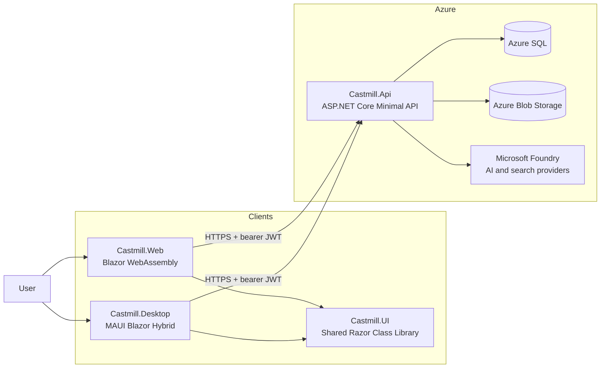
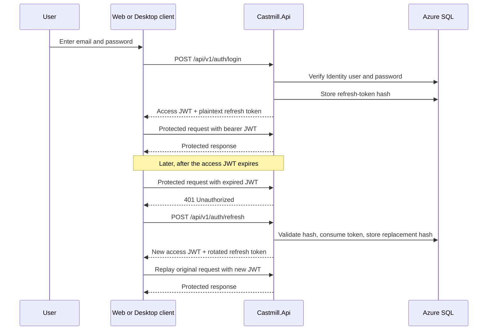
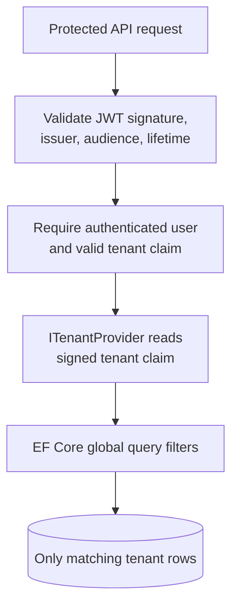

# Basic Architecture and Authentication

This document gives a concise view of the current Castmill application architecture and
explains how users authenticate, how sessions are renewed, and how tenant access is enforced.
For detailed decisions, see [Backend-Architecture.md](../Backend-Architecture.md) and
[Frontend-Architecture.md](../Frontend-Architecture.md).

## Application architecture

Castmill uses a shared Blazor UI with two client shells:

- **Castmill.Web** is a Blazor WebAssembly client.
- **Castmill.Desktop** is a .NET MAUI Blazor Hybrid client for macOS and Windows.
- **Castmill.UI** is the Razor Class Library containing the shared screens, state stores,
  typed API clients, editor, and design system used by both shells.
- **Castmill.Api** is a .NET 10 ASP.NET Core Minimal API. It owns authentication,
  authorization, tenant isolation, persistence, AI orchestration, storage access, and
  publishing integrations.
- **Azure SQL** stores users, Identity records, refresh-token hashes, campaigns, artifacts,
  image metadata, and audit events.
- **Azure Blob Storage** stores source media, generated images, and published derivatives.
- **Microsoft Foundry and related providers** supply text, image, transcription, and search
  capabilities. Provider credentials remain on the server or in encrypted server custody.



The Web client and API are currently deployed together on one Linux Azure App Service. The
desktop application is a thin native client of the same deployed API. Clients never receive
database credentials, storage account keys, Foundry keys, or publishing-provider secrets.

## Authentication model

Castmill owns its user accounts. It does **not** currently use Microsoft Entra ID, Google,
or another external identity provider for application sign-in.

Authentication uses:

- ASP.NET Core Identity;
- email and password credentials;
- an application-issued access JWT;
- a rotating opaque refresh token; and
- bearer authentication on protected API requests.

This is token-based authentication, not cookie authentication.

### Registration and login

The anonymous authentication endpoints are under `/api/v1/auth`:

| Endpoint | Purpose |
| --- | --- |
| `POST /register` | Creates a tenant and its first user, then issues tokens |
| `POST /login` | Validates email/password and issues tokens |
| `POST /refresh` | Exchanges a refresh token for a new access/refresh pair |
| `POST /logout` | Revokes active refresh tokens for the signed-in user |
| `POST /change-password` | Changes the password, revokes old sessions, and issues a new pair |

Registration permanently creates one tenant for the user. The user record stores that
`TenantId`; clients cannot choose a different tenant during requests.

Identity configuration currently requires:

- a unique email address;
- a minimum password length of 12 characters;
- no forced character-composition rules;
- lockout after 5 failed sign-in attempts; and
- a 15-minute lockout period.

Unknown email addresses and incorrect passwords both return the same unauthorized response,
which avoids disclosing whether an account exists. Anonymous auth endpoints also have a
per-IP rate limit.

### Issued tokens

A successful registration, login, refresh, or password change returns two credentials.

#### Access token

The access token is a signed JWT with a default lifetime of approximately 15 minutes. It is
signed by the API with HMAC-SHA256 and includes these important claims:

| Claim | Meaning |
| --- | --- |
| `sub` | User identifier |
| `jti` | Unique token identifier |
| `email` | User email address |
| `tenant` | Permanent tenant identifier |
| `name` | Display name |

The API validates the issuer, audience, lifetime, signing key, and exact signing algorithm.
The accepted clock skew is one minute. Production startup fails if the server signing key is
missing or too short.

#### Refresh token

The refresh token is an opaque, cryptographically random 256-bit value with a default
lifetime of 30 days. It belongs to a token family representing the session lineage.

The plaintext refresh token is returned to the client only when issued. The database stores
only its SHA-256 hash. A database disclosure therefore does not directly reveal usable
refresh tokens.

Refresh tokens rotate on use:

1. The client sends the current refresh token to `/refresh`.
2. The API hashes it and finds the corresponding database row.
3. The API marks that token as used.
4. The API creates a new access token and a new refresh token in the same family.
5. The client replaces its in-memory and persisted refresh token with the new value.

A short reuse grace window, 60 seconds by default, handles an application crash during
rotation, two windows racing, or a network retry. Reuse outside that grace window is treated
as possible theft and revokes every active token in the family.

### Client request flow

Every shared UI API request passes through `CastmillHttpHandler`:

1. It creates a correlation ID.
2. It adds the current access token as an `Authorization: Bearer` header.
3. It sends the request.
4. If a protected request returns `401`, it attempts one silent refresh.
5. If refresh succeeds, it clones and replays the original request once with the new access
   token and the same correlation ID.
6. It never loops indefinitely and never tries to refresh anonymous login/register calls.

Refresh is single-flight within the client. If several requests receive `401` together, only
one exchanges the single-use refresh token; the others reuse the result rather than causing
a false token-reuse event.



## Token custody by client

The access JWT is held only in process memory in both clients. It is deliberately not
persisted because it is short-lived and can be recreated with the refresh token.

| Client | Access token | Refresh token |
| --- | --- | --- |
| Web | Memory only | Browser-backed UI storage under `cm.auth.refresh` |
| Desktop | Memory only | Platform `SecureStorage` when available; otherwise an owner-only app-data file |

Web storage is readable by JavaScript running on the application origin, so the Web security
posture depends on maintaining a strict Content Security Policy and preventing script
injection.

On desktop, `SecureStorage` maps to Keychain on macOS and protected credential storage on
Windows. Development Mac Catalyst builds cannot use Keychain without a signed entitlement,
so they fall back to a file created with user-only read/write permissions (`0600`). The live
process keeps the refresh token in memory first, so a persistence failure may prevent session
restore after restart but does not end an active session.

Only a definitive unauthorized response from the refresh endpoint clears the client session.
Transient API errors, network failures, and cancellations keep the refresh token so the
client can try again later.

## Authorization and tenant isolation

Authentication answers **who the user is**. Authorization and tenant isolation answer
**which data that user may access**.

### How a login becomes an Azure SQL boundary

In the current model, every user owns exactly one tenant. That tenant is the isolation unit
for content in Azure SQL.

The chain from login to database row is:

1. Registration creates a new `Tenant` row and a new Identity user in one flow.
2. The user's `TenantId` is stored permanently on the `CastmillUser` record.
3. Login loads that user server-side; the client does not submit a tenant choice.
4. The API signs the user's stored `TenantId` into the access JWT as the `tenant` claim.
5. JWT bearer middleware verifies the signature before the claim is trusted.
6. `HttpContextTenantProvider` reads the tenant from that validated claim.
7. `CastmillDbContext` global query filters add the current tenant condition to normal
  queries for tenant-owned entities.
8. Create endpoints stamp new rows with the same server-resolved tenant ID.

For example, an application query that conceptually asks for all campaigns behaves like:

```sql
SELECT *
FROM Campaigns
WHERE TenantId = @CurrentAuthenticatedTenantId;
```

The endpoint does not accept `@CurrentAuthenticatedTenantId` from the browser. It comes from
the signed token through `ITenantProvider`.

The same pattern protects dependent content such as artifacts, source evidence, image slots,
image variants, generation runs, schedules, brand data, settings, publications, and audit
events. Their rows carry a `TenantId`, and their EF models have tenant query filters.

### Read isolation

For a signed-in request, EF Core automatically constrains normal reads to rows whose
`TenantId` matches the current JWT tenant. A request containing another user's campaign or
artifact GUID therefore does not make that row visible through an ordinary tenant-filtered
query; it behaves as missing.

This is stronger than relying on every endpoint author to remember a manual
`WHERE TenantId = ...` clause. The restriction is part of the entity model and is applied
whenever that entity is queried through the request's `CastmillDbContext`.

### Write isolation

The server also owns tenant assignment on writes. Create paths obtain `TenantId` from
`ITenantProvider` or copy it from an already tenant-filtered parent entity. The client sends
content fields such as a campaign name, artifact body, or image choice; it does not choose
the tenant written to the row.

Updates and deletes first locate the existing entity through tenant-filtered queries. A user
cannot update another tenant's row merely by guessing its GUID because that entity is not
loaded into the request's tenant-scoped context.

### Azure SQL security boundary

The current design uses **application-level row isolation through EF Core global query
filters**. It does **not** currently define an Azure SQL Row-Level Security policy with SQL
security predicates or `SESSION_CONTEXT`.

The App Service connects to Azure SQL through its managed identity. Azure SQL authenticates
the application identity and grants only the configured database roles; it does not receive
the end user's JWT or separately authenticate each Castmill user. Per-user content isolation
therefore happens inside `Castmill.Api` before and while it queries SQL.

This means the important trust boundary is:

- clients cannot connect directly to Azure SQL;
- clients cannot choose or override `TenantId`;
- only the API's managed identity has database access;
- the API validates the JWT and establishes the current tenant;
- EF query filters constrain rows for normal request code; and
- server-side write paths stamp the trusted tenant ID.

The model protects one user from another through the application, but it should not be
described as database-native RLS. A future defense-in-depth improvement could add Azure SQL
RLS using a server-set session context. That would protect rows even if application code
accidentally bypassed an EF filter, but it is not part of the present implementation.

Protected business endpoints require the `TenantAllowed` policy. That policy requires:

- an authenticated JWT principal; and
- a valid GUID in the signed `tenant` claim.

`HttpContextTenantProvider` reads the tenant only from the validated JWT claim. It never
accepts tenant identity from a request header, query parameter, or route value.

Tenant-scoped database entities implement `ITenantScoped`. `CastmillDbContext` applies EF
Core global query filters comparing each row's `TenantId` to the current JWT tenant. These
filters cover campaigns, artifacts, evidence, image slots and variants, settings, schedules,
audit events, and other tenant-owned records.



This design makes tenant isolation structural: endpoint code does not need to remember to
add a tenant predicate to every ordinary query. New tenant-scoped entity types must still be
registered with a query filter and covered by an isolation test.

### Isolation properties and limits

| Property | Current behavior |
| --- | --- |
| Isolation key | `TenantId` stored on the user and every tenant-owned row |
| Tenant source | Signed JWT `tenant` claim |
| Tenant selection by client | Not allowed |
| Read enforcement | EF Core global query filters |
| Write enforcement | Server stamps tenant ID; parent lookups are tenant-filtered |
| Direct client SQL access | None |
| Azure SQL connection identity | App Service managed identity |
| Azure SQL native RLS | Not currently enabled |
| Current account model | One user owns one tenant |

## Session termination

### Logout

Logout revokes all active refresh tokens for the user. The client clears its in-memory and
persisted tokens. An already issued access JWT is not placed on a revocation list; it simply
expires within its short lifetime.

### Password change

Changing a password requires an authenticated session and the current password. A successful
change revokes all active refresh tokens, records an audit event, and issues a new token
family to the current client.

### Refresh-token reuse

A used, revoked, or expired refresh token presented outside the configured grace window
causes the active refresh tokens in that family to be revoked. The event is recorded in the
audit log as possible reuse.

## Security controls around authentication

- Password hashing and lockout are provided by ASP.NET Core Identity.
- Access tokens use only HMAC-SHA256; algorithm downgrade is not accepted.
- The JWT signing key remains server-side and is validated during startup.
- Refresh tokens contain 256 bits of cryptographic randomness.
- Only refresh-token hashes are stored in SQL.
- Anonymous auth requests are rate-limited by source IP.
- Auth events such as registration, login, failed login, lockout, refresh reuse, logout, and
  password change are recorded in `AuditEvent` rows.
- Production CORS uses an explicit origin list rather than a wildcard.
- Client requests use HTTPS in production.
- Application/provider secrets are never included in JWTs or client configuration.

## Current limitations

- There is no external SSO or federated identity provider.
- There is no user-facing multifactor authentication flow yet, although ASP.NET Core
  Identity provides extension points for it.
- Password reset by email is not available because the application does not yet have an
  email sender.
- The current registration model creates one tenant per user; multi-user organization
  membership and tenant switching are not part of the present model.
- Web refresh-token custody is browser storage rather than an HttpOnly cookie, making CSP
  and XSS prevention especially important.
- Access JWTs are not individually revoked on logout; their short lifetime limits the
  remaining exposure.

## Relevant implementation files

- `src/Castmill.Api/Auth/AuthEndpoints.cs`
- `src/Castmill.Api/Auth/TokenService.cs`
- `src/Castmill.Api/Auth/RefreshToken.cs`
- `src/Castmill.Api/Data/CastmillDbContext.cs`
- `src/Castmill.Api/Tenancy/ITenantProvider.cs`
- `src/Castmill.Api/Program.cs`
- `src/Castmill.UI/Auth/TokenProviderBase.cs`
- `src/Castmill.UI/Http/CastmillHttpHandler.cs`
- `src/Castmill.Web/Platform/WebTokenProvider.cs`
- `src/Castmill.Desktop/Platform/DesktopTokenProvider.cs`
